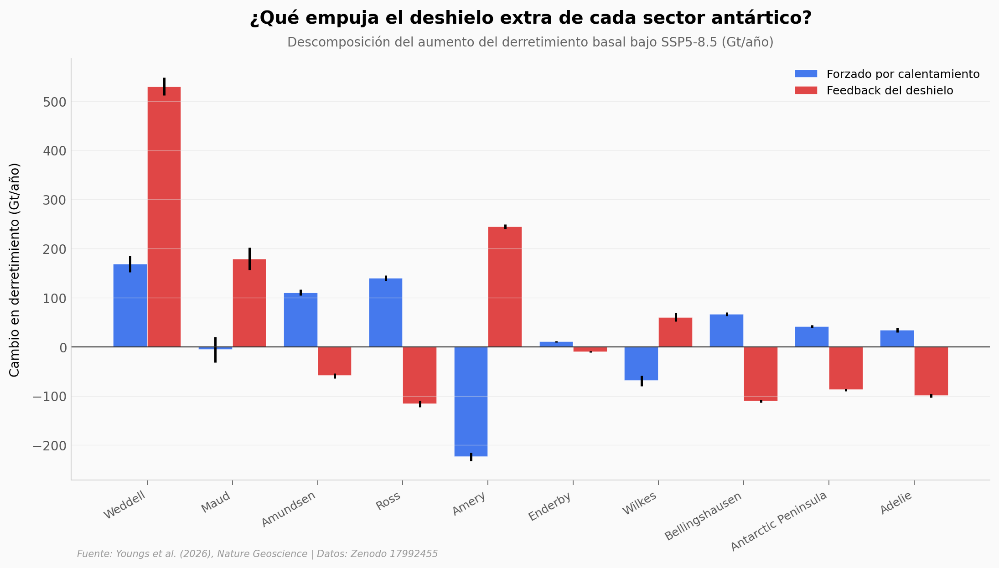

# Dos tercios del deshielo extra de la Antártida vienen del propio deshielo

Una simulación de la Antártida completa bajo el peor escenario climático del IPCC (SSP5-8.5) descompone el aumento del derretimiento basal de las plataformas de hielo en dos piezas: lo que mete el calentamiento directo del océano y lo que añade el propio agua de deshielo al volver a la cavidad. La segunda pieza explica el 66% del aumento total — un feedback que la mayoría de modelos climáticos ni siquiera tiene.

**El hallazgo:** **531 Gt/año adicionales** de deshielo por año vienen del feedback del propio deshielo, comparado con **274 Gt/año** del calentamiento directo. Y el feedback no es uniforme: amplifica en 4 sectores (Weddell, Amery, Maud, Wilkes) y protege en 6 (Ross, Bellingshausen, Adelie, Península, Amundsen, Enderby).

## Gráfica clave



## Reproducir

[](https://colab.research.google.com/github/Ciencia-a-Mordiscos/lab/blob/main/papers/2026-05-15-antartida-feedbacks-deshielo/notebook.ipynb)

O localmente:

```bash
pip install pandas matplotlib numpy scipy
jupyter execute notebook.ipynb
```

## Datos

- `datos/melt_change_por_sector.csv` — Cambio en derretimiento por sector (Gt/año), descompuesto en respuesta forzada y feedback. 10 sectores antárticos.
- `datos/temperatura_cambio_por_sector.csv` — Cambio en temperatura del agua (°C) por sector. Misma descomposición.
- `datos/salinidad_cambio_por_sector.csv` — Cambio en salinidad (g/kg) por sector. Misma descomposición.

Los tres CSVs corresponden a la simulación SSP5-8.5 del paper, promediada sobre los últimos 120 meses (10 años) de la corrida.

## Links

- **Video:** [Ver en YouTube](https://youtube.com/shorts/aBVIIwcXwxs)
- **Paper:** [Nature Geoscience — DOI: 10.1038/s41561-026-01975-6](https://doi.org/10.1038/s41561-026-01975-6)
- **Datos originales:** [Zenodo: mkyoungs/NG_SO_IceShelf](https://zenodo.org/records/17992455)
