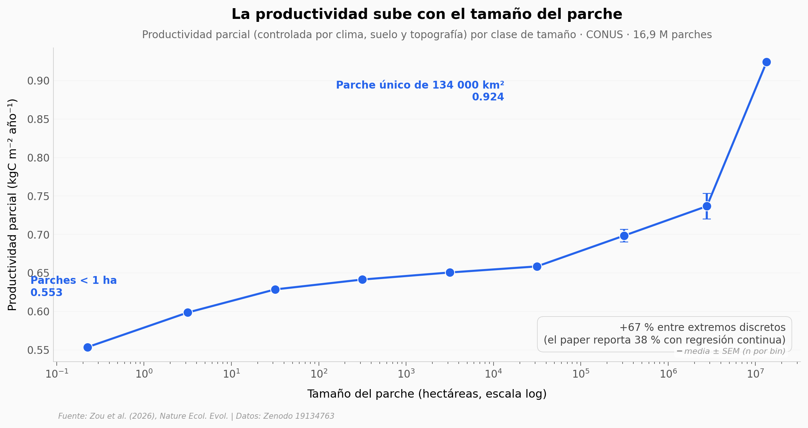

# Parches grandes de bosque capturan más carbono por hectárea que los pequeños

Un análisis de 16,9 millones de parches forestales en Estados Unidos continental — más cinco continentes con datos globales — muestra que la productividad por unidad de área crece de forma sistemática con el tamaño del parche. Esto significa que la fragmentación del bosque cuesta carbono incluso cuando el área total se mantiene.

**El hallazgo:** la fragmentación que ya existe en CONUS reduce la productividad forestal en **0,16 GtC al año** (14 % vs un escenario de bosques contiguos). Una hectárea metida dentro de un bosque de ~100 000 km² es 38 % más productiva que esa misma hectárea aislada.

## Gráfica clave



## Reproducir

[](https://colab.research.google.com/github/Ciencia-a-Mordiscos/lab/blob/main/papers/2026-05-15-parches-bosque-productividad/notebook.ipynb)

O localmente:
```bash
pip install pandas matplotlib numpy
jupyter execute notebook.ipynb
```

## Datos

- `datos/npp_por_tamano.csv` — Productividad parcial (NPP/GPP) por clase de tamaño de parche. 9 bins log-spaced, n total = 16 913 643 parches.
- `datos/escenarios_npp.csv` — NPP total CONUS bajo 3 configuraciones contrafactuales (más fragmentada / actual / menos fragmentada).
- `datos/importancia_variables.csv` — Importancia (caída en R²) de 7 variables predictoras en un Random Forest.
- `datos/pendientes_por_continente.csv` — Pendientes de regresión NPP/GPP vs tamaño de parche, por los 6 continentes.

## Links

- **Video:** [Pendiente]
- **Paper:** [*Nature Ecology & Evolution* — DOI: 10.1038/s41559-026-03075-5](https://doi.org/10.1038/s41559-026-03075-5)
- **Datos originales:** [Zenodo · v3.0.0](https://doi.org/10.5281/zenodo.19134763)
