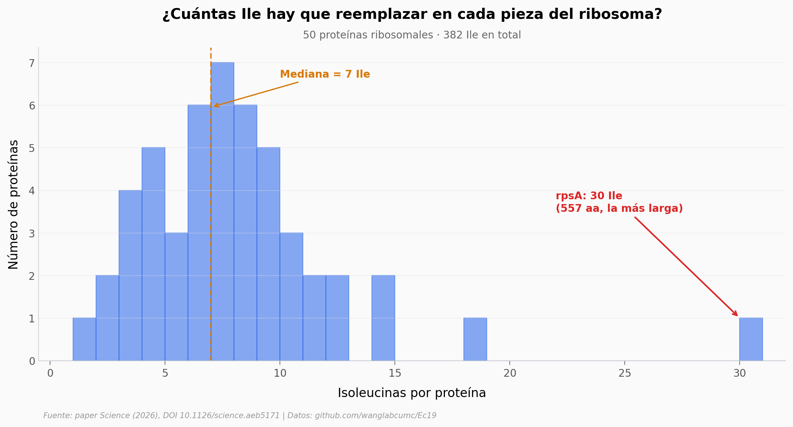

# 382 isoleucinas que sobraban

Todos los organismos conocidos usan 20 aminoácidos canónicos. El [Wang Lab de Columbia](https://github.com/wanglabcumc/Ec19) probó si una *Escherichia coli* podía vivir con 19 — quitándole la isoleucina. Para empezar, rediseñaron el ribosoma reemplazando los 382 residuos de Ile distribuidos en sus 50 proteínas. Este notebook recrea ese conteo desde el FASTA público y explora cómo se reparte el trabajo de rediseño.

**El hallazgo:** **El ribosoma de E. coli contiene 382 residuos de Ile en 50 proteínas, y 10 de esas proteínas concentran el 37 % de todo el rediseño.**

## Gráfica clave



## Reproducir

[](https://colab.research.google.com/github/Ciencia-a-Mordiscos/lab/blob/main/papers/2026-05-16-19-aminoacidos-ec19/notebook.ipynb)

O localmente:
```bash
pip install pandas matplotlib numpy
jupyter execute notebook.ipynb
```

## Datos

- `datos/ecoli_ribosomal_genes.fasta` — 50 secuencias proteicas wild-type del ribosoma de *E. coli* (UniProt), tomadas del repo del paper.
- `datos/ribosomal_genes_ile.csv` — Tabla derivada: 50 filas con `uniprot_id`, `gene_name`, `length_aa`, `ile_count`, `val_count`, `ile_pct`.
- `datos/aa_composition_global.csv` — Composición global de los 20 aminoácidos sobre las 50 proteínas (counts + porcentajes).

## Links

- **Video:** [Pendiente]
- **Paper:** [Science — DOI: 10.1126/science.aeb5171](https://doi.org/10.1126/science.aeb5171)
- **Código y datos originales:** [github.com/wanglabcumc/Ec19](https://github.com/wanglabcumc/Ec19)
- **Datos del pipeline computacional:** [Zenodo 10.5281/zenodo.18155920](https://doi.org/10.5281/zenodo.18155920) · [10.5281/zenodo.18202555](https://doi.org/10.5281/zenodo.18202555)
