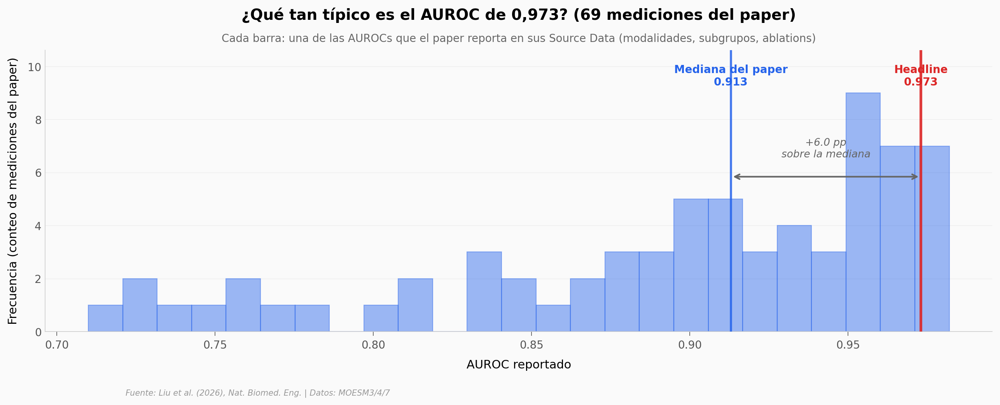

# BINDS: cáncer de mama por IA, examinado por dentro

Un equipo en China entrenó BINDS, un modelo de deep learning que combina ecografía, mamografía y resonancia para diagnosticar cáncer de mama. El paper anuncia un AUROC de 0,973 sobre 27.048 pacientes. Bajamos sus Source Data (MOESM3, MOESM4, MOESM7) y miramos qué tan robusto es ese número cuando lo desmenuzamos por modalidad, por subgrupo clínico y por cantidad de datos de entrenamiento.

**El hallazgo:** El AUROC de **0,973** es la mediana del paper +6 puntos porcentuales — vive en el mejor escenario posible (paciente con las tres modalidades). Con solo ultrasonido el AUC cae a **0,876**, y en pacientes BI-RADS 4A — el caso clínicamente más ambiguo — el intervalo de confianza se abre a **[0,76–0,97]**.

## Gráfica clave



## Reproducir

[](https://colab.research.google.com/github/Ciencia-a-Mordiscos/lab/blob/main/papers/2026-05-19-binds-cancer-mama-ia/notebook.ipynb)

O localmente:

```bash
pip install pandas matplotlib numpy
jupyter execute notebook.ipynb
```

## Datos

- `datos/auroc_riesgo_por_modalidad.csv` — AUROC interna y externa por combinación de modalidad (7 filas, fig 3a radar plot).
- `datos/desempeno_por_subgrupo.csv` — AUC-ROC, AUC-PR, F1 con 95% CI por subgrupo (Overall, BI-RADS 4A/4B/4C, edad, T-stage, subtipo molecular). 13 filas, fig 3c.
- `datos/eficiencia_datos_entrenamiento.csv` — AUROC vs % training data (10/25/50/75/100) por modalidad. 5 filas, Extended Fig 5b.
- `datos/ablacion_random_masking.csv` — Comparación BINDS vs sin random masking en combinaciones bi y trimodales. 8 filas, Extended Fig 5e.
- `datos/auroc_subtipo_por_modalidad.csv` — AUROC para clasificación de subtipo molecular por modalidad. 7 filas, fig 3b.

Origen: Supplementary Source Data del paper (Nature Biomedical Engineering, 2026). Springer Nature Source Data terms.

## Links

- **Video:** [Ver en YouTube](https://youtube.com/shorts/c63p_gdmKdU)
- **Paper:** [Nat. Biomed. Eng. — DOI: 10.1038/s41551-026-01654-2](https://doi.org/10.1038/s41551-026-01654-2)
- **Código de BINDS:** [github.com/lyhkevin/BINDS](https://github.com/lyhkevin/BINDS) (MIT)
