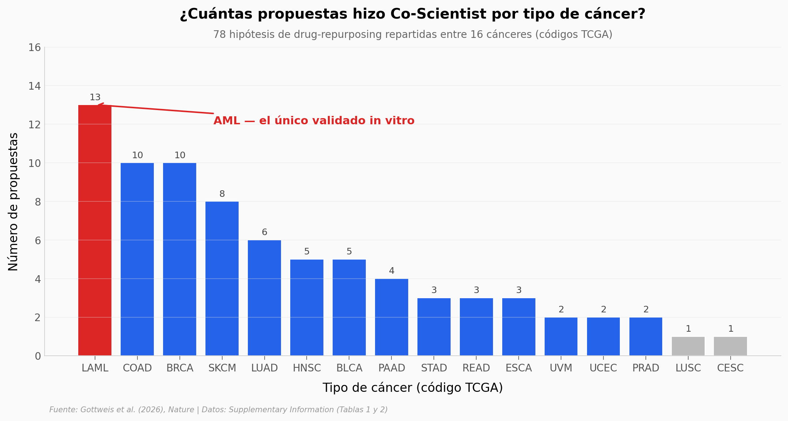

# Co-Scientist: el AI que propone 78 hipótesis y los humanos eligen una

Google DeepMind publicó en *Nature* (mayo 2026) **Co-Scientist**, un sistema multi-agente AI (sobre Gemini) que genera, critica y refina hipótesis científicas en torneos internos. El paper lo valida en biomedicina, generando ideas para reposicionar medicamentos contra 16 tipos de cáncer.

**El hallazgo:** **De las 78 propuestas totales, 13 (17%) fueron para leucemia mieloide aguda (AML) — el único cáncer que el equipo llevó a validación in vitro.** La distribución por cáncer está sesgada (mediana 3.5 propuestas/cáncer, AML con 13 es outlier).

## Gráfica clave



## Reproducir

[](https://colab.research.google.com/github/Ciencia-a-Mordiscos/lab/blob/main/papers/2026-05-19-co-scientist/notebook.ipynb)

O localmente:
```bash
pip install pandas matplotlib numpy
jupyter execute notebook.ipynb
```

## Datos

- `datos/cancer_types_proposals.csv` — Tabla 2 SI: 16 cánceres con su conteo de propuestas drug-repurposing (78 totales).
- `datos/agent_ablations.csv` — Tabla 1 SI: 7 métricas before/after de ablations sobre 3 agentes (Reflection, Evolution, Meta-review).

## Links

- **Video:** [Ver en YouTube](https://youtube.com/shorts/nwpms2J1YUU)
- **Paper:** [Nature — DOI: 10.1038/s41586-026-10644-y](https://doi.org/10.1038/s41586-026-10644-y)
- **Supplementary Information:** [PDF Springer (119 pp)](https://static-content.springer.com/esm/art%3A10.1038%2Fs41586-026-10644-y/MediaObjects/41586_2026_10644_MOESM1_ESM.pdf)
