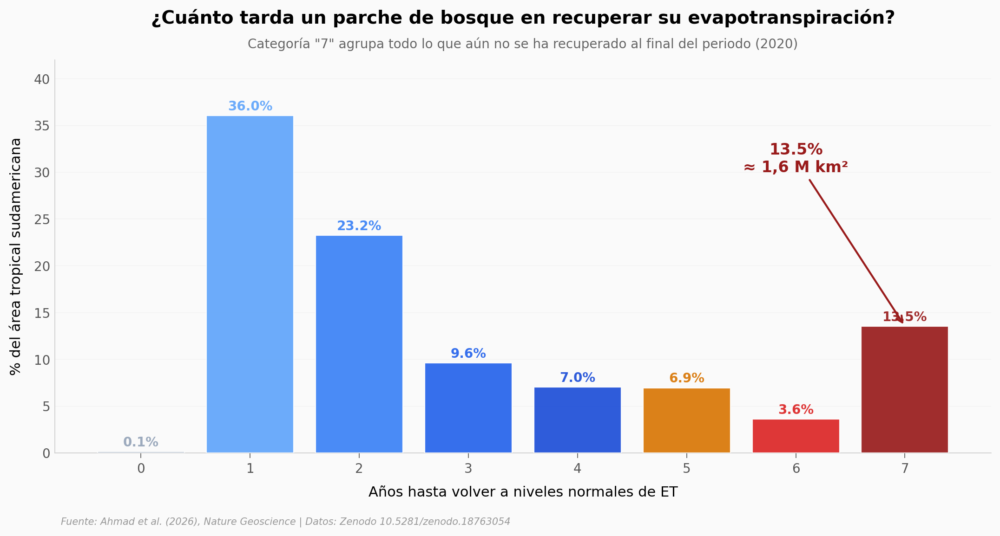

# 1,6 millones de km² de selva no han vuelto a "sudar" igual

El 13,5% del bosque tropical sudamericano tarda **más de 7 años** en recuperar su evapotranspiración tras un disturbio. Hablamos de 1,6 millones de km² — más que Perú entero y casi tres veces España — donde el "sudor" de la selva no vuelve a su valor histórico en 18 años de observación satelital. Ahmad y su equipo (Nature Geoscience, 2026) cruzaron un modelo hidrológico Noah-MP con datos de humedad del suelo, biomasa y agua subterránea para mapearlo a 1 km de resolución.

**El hallazgo:** **Solo el 36% del territorio recupera su ET en un año. El 13,5% no la ha recuperado en 7 años o más. Y los parches que más tardan son también los que sufren un decline más profundo** (Spearman ρ = -0,36, p<10⁻⁹).

## Gráfica clave



## Reproducir

[](https://colab.research.google.com/github/Ciencia-a-Mordiscos/lab/blob/main/papers/2026-05-19-evapotranspiracion-deforestacion-sudamerica/notebook.ipynb)

O localmente:
```bash
pip install pandas matplotlib numpy
jupyter execute notebook.ipynb
```

## Datos

- `datos/persistence_distribution.csv` — Distribución de años hasta recovery (0–7+), por nº y % de área (8 filas)
- `datos/intensity_distribution.csv` — Histograma binned (paso 0,5σ) de magnitud del decline en ESI (14 bins)
- `datos/intensity_vs_persistence.csv` — Relación años-hasta-recovery × intensidad media (8 filas)
- `datos/spatial_heatmap.csv` — Raster downsampled 48× a ~80×75 píxeles con lat, lon, persistence, intensity (5.260 puntos)
- `datos/summary_stats.csv` — 14 métricas globales (media, mediana, std, percentiles, % hotspots)

Los CSVs son agregados servidor-side de los rasters originales `ET_PERSISTENCE.tif` (4,78 MB) y `ET_INTENSITY.tif` (102 MB) en Zenodo.

## Links

- **Video:** [Ver en YouTube](https://youtube.com/shorts/YLKU-CntIfc)
- **Paper:** [Nature Geoscience — DOI: 10.1038/s41561-026-01981-8](https://doi.org/10.1038/s41561-026-01981-8)
- **Datos originales:** [Zenodo 10.5281/zenodo.18763054](https://doi.org/10.5281/zenodo.18763054)
