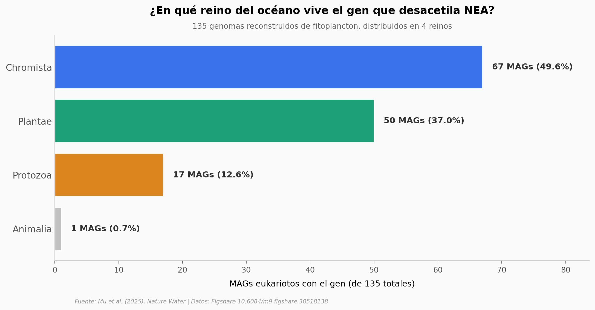

# Fitoplancton reconvierte progestogenos a su forma activa

Cuando una mujer toma una pastilla anticonceptiva con acetato de noretindrona (NEA), su hígado la procesa para reducir su actividad antes de excretarla. Lo que un equipo encontró en Nature Water es que el fitoplancton hace exactamente lo contrario: le arranca el acetato y lo convierte en noretindrona — un neuroesteroide más potente. Y no es un truco de unas pocas algas raras: la enzima responsable, una *adenylosuccinate lyase*, aparece en 135 genomas de fitoplancton de **11 océanos** y en **29.709 genomas procariotas**.

**El hallazgo:** **18 especies de fitoplancton (las 18 ensayadas) reconvierten NEA en noretindrona; el gen responsable aparece distribuido globalmente.**

## Gráfica clave



Casi nueve de cada diez MAGs eukariotos con el gen caen en *Chromista* (haptofitas, dinoflagelados) y *Plantae* (algas verdes) — dos reinos que divergieron hace cientos de millones de años. La huella molecular es muy antigua.

## Reproducir

[](https://colab.research.google.com/github/Ciencia-a-Mordiscos/lab/blob/main/papers/2026-05-19-fitoplancton-reconvierte-progestogenos/notebook.ipynb)

O localmente:
```bash
pip install pandas matplotlib numpy
jupyter execute notebook.ipynb
```

## Datos

- `datos/fitoplancton_mags.csv` — 135 MAGs eukariotos con el gen, con su taxonomía completa y océano de origen.
- `datos/fitoplancton_por_oceano.csv` — agregado por cuenca oceánica (11 océanos).
- `datos/fitoplancton_por_reino.csv` — agregado por reino (Chromista, Plantae, Protozoa, Animalia).
- `datos/fitoplancton_por_phylum.csv` — agregado por phylum (10 phyla, Chlorophyta lidera).
- `datos/procariotas_con_lyase_por_phylum.csv` — 29.709 genomas procariotas con la lyase agrupados en 140 phyla.
- `datos/procariotas_culturabilidad.csv` — breakdown culturable/no culturable por dominio (Archaea/Bacteria).

Todos los datasets vienen de las Tablas S1 y S2 del Supplementary del paper (Figshare, [10.6084/m9.figshare.30518138](https://doi.org/10.6084/m9.figshare.30518138)).

## Links

- **Video:** [Pendiente]
- **Paper:** [Nature Water — DOI: 10.1038/s44221-026-00646-5](https://doi.org/10.1038/s44221-026-00646-5)
- **Datos originales:** [Figshare](https://doi.org/10.6084/m9.figshare.30518138)
