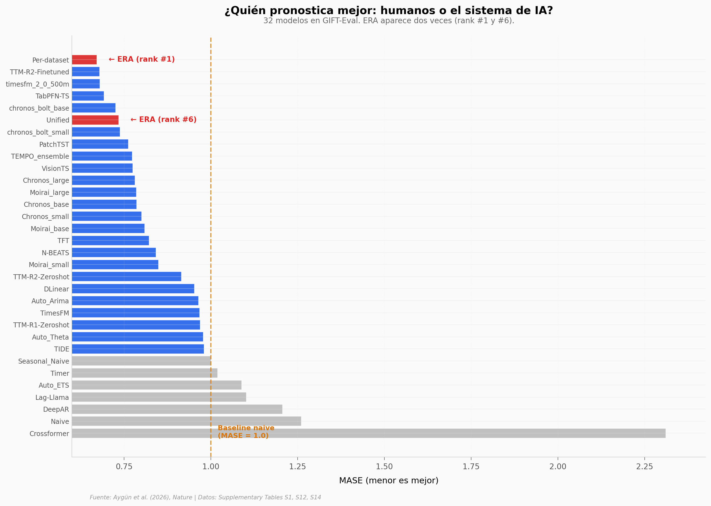

# IA escribe software científico expert-level

Un sistema de IA (LLM + búsqueda en árbol) puso 30 modelos diseñados por humanos detrás de sí en un benchmark público de pronóstico de series temporales. Y en segmentación de imágenes satelitales, sus tres soluciones superaron a cinco papers publicados entre 2021 y 2025. En este notebook abrimos las tablas del Supplementary del paper para ponerle números concretos a la frase "expert-level" del abstract.

**El hallazgo:** **ERA Per-dataset queda #1 entre 32 modelos en GIFT-Eval (MASE = 0.671), por 1.19 % delante del segundo puesto humano. En DLRSD, sus tres soluciones (mIoU 0.80–0.82) superan al mejor paper previo (RE-Net 2021, mIoU = 0.762) por 5–7.6 % relativo.**

## Gráfica clave



## Reproducir

[](https://colab.research.google.com/github/Ciencia-a-Mordiscos/lab/blob/main/papers/2026-05-19-ia-software-cientifico-experto/notebook.ipynb)

O localmente:

```bash
pip install pandas matplotlib numpy
jupyter execute notebook.ipynb
```

## Datos

- `datos/gift_eval_leaderboard.csv` — 32 modelos del leaderboard GIFT-Eval, snapshot 2025-05-18 (columnas: model, mase, type). Source: Supplementary Table S12.
- `datos/dlrsd_benchmark.csv` — 8 métodos en segmentación geoespacial DLRSD: 3 soluciones ERA + 5 papers publicados 2021–2025 (columnas: method, year, architecture_type, key_features, miou, source). Source: Supplementary Table S14.
- `datos/computational_budget.csv` — Presupuesto de cómputo por tarea: 6 benchmarks con tokens y duración (columnas: task, request_tokens, response_tokens, duration_min, sandbox_type). Source: Supplementary Table S1.

## Limitaciones

- Snapshot del leaderboard GIFT-Eval congelado en 2025-05-18 — otros releases pueden tener un nuevo #1.
- Dos claims del abstract (40 métodos en single-cell, 14 modelos COVID que baten al ensemble CDC) no tienen tabla numérica completa en el Supplementary — solo descripción cualitativa.
- El paper no compara ERA contra otros agentes de IA que escriben código (AlphaCode, AutoML), solo contra baselines humanos del leaderboard.
- "Expert-level" es la caracterización de los autores, no un test ciego de un comité independiente.

## Links

- **Video:** [Pendiente]
- **Paper:** [Nature — DOI: 10.1038/s41586-026-10658-6](https://doi.org/10.1038/s41586-026-10658-6)
- **Datos originales:** [Supplementary Information (Nature)](https://static-content.springer.com/esm/art%3A10.1038%2Fs41586-026-10658-6/MediaObjects/41586_2026_10658_MOESM1_ESM.pdf)
