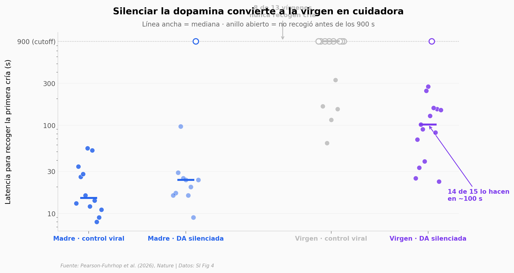

# Dopamina y cerebro maternal

Un paper de Nature explora cómo el embarazo y el postparto remodelan permanentemente el cerebro de la madre, identificando al hipocampo dorsal y a la dopamina como ejes mecanicistas. Combinando ARN-seq, separación crónica madre-cría y manipulación química directa, el equipo establece que silenciar la liberación de dopamina en el hipocampo dorsal de una virgen es suficiente para que recoja crías como una madre experimentada.

**El hallazgo:** **8 de 13 vírgenes con control viral nunca recogen una cría antes del cutoff de 900 s. Con dopamina silenciada químicamente, 14 de 15 lo hacen — mediana 102 s, Cohen *d* = -1,50, Mann-Whitney *p* = 0,0018.**

## Gráfica clave



## Reproducir

[](https://colab.research.google.com/github/Ciencia-a-Mordiscos/lab/blob/main/papers/2026-05-20-dopamina-cerebro-maternal/notebook.ipynb)

O localmente:
```bash
pip install pandas matplotlib numpy scipy
jupyter execute notebook.ipynb
```

## Datos

- `datos/fig2_estres_recall.csv` — 34 ratones C57BL/6J (3 grupos: NP, Control RE, Stress RE) · columnas: animal_id, grupo, tam_camada, preshock_1..5, context_test_freezing, estro.
- `datos/fig4_pup_pickup.csv` — 51 ratones (4 combinaciones grupo × virus chemogenético hM4Di/mCherry) · columnas: animal_id, pup1_latencia_s, pup2_latencia_s, grupo, virus, estro, estradiol.

## Links

- **Video:** [Pendiente]
- **Paper:** [Dopamine drives persistent remodelling of the maternal brain — Nature, DOI: 10.1038/s41586-026-10509-4](https://doi.org/10.1038/s41586-026-10509-4)
- **Datos originales:** [Supplementary Information del paper (Springer Nature MOESM5)](https://static-content.springer.com/esm/art%3A10.1038%2Fs41586-026-10509-4/MediaObjects/41586_2026_10509_MOESM5_ESM.xlsx)
