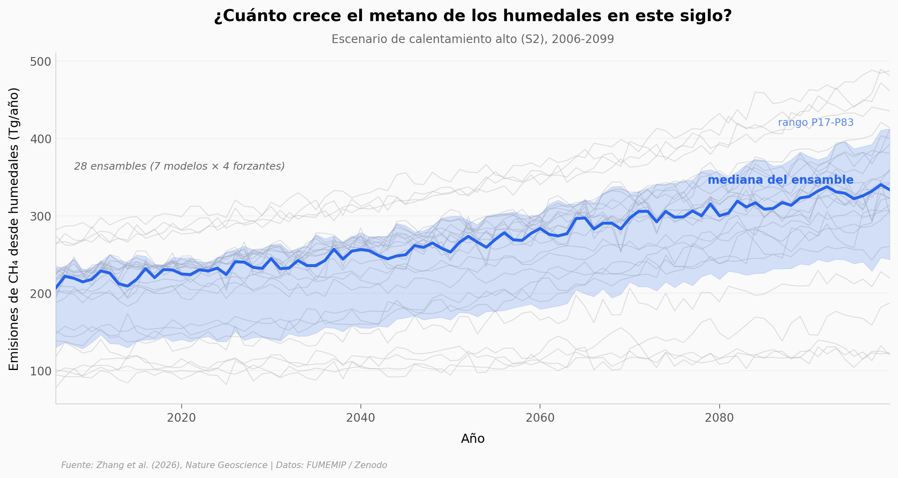

# Humedales y metano: 28 modelos, el mismo veredicto

Un equipo internacional corrió 28 simulaciones independientes (7 modelos terrestres × 4 modelos atmosféricos) para proyectar las emisiones de metano de humedales del mundo bajo un calentamiento alto. Los 28 caminos apuntan a lo mismo: bajo el escenario alto, los humedales aumentan su metano un 54% mediano hacia los 2090s. Solo en la década de los 2030, ese aumento ya equivaldría al 9% del metano humano actual — una cifra "comparable" (en palabras del paper) a lo que el Global Methane Pledge prometió recortar.

**El hallazgo:** 28/28 ensambles aumentan; mediana global +54% (P17-P83: 37-64%); el aumento extra solo en 2030s suma ~35 Tg/año, frente a ~114 Tg/año que recorta el Pledge.

## Gráfica clave



## Reproducir

[](https://colab.research.google.com/github/Ciencia-a-Mordiscos/lab/blob/main/papers/2026-05-20-metano-humedales-clima/notebook.ipynb)

O localmente:
```bash
pip install pandas matplotlib numpy
jupyter execute notebook.ipynb
```

## Datos

- `datos/eCH4_annual_global.csv` — eCH4 global anual 2006-2099, 28 ensambles (94 filas × 30 cols)
- `datos/eCH4_annual_tropics.csv` — eCH4 región tropical (94 × 30)
- `datos/eCH4_annual_boreal.csv` — eCH4 región boreal (94 × 30)
- `datos/eCH4_annual_temperate.csv` — eCH4 región templada (94 × 30)
- `datos/eCH4_annual_extropics.csv` — eCH4 polar sur (94 × 30)
- `datos/wetland_eCH4_feedback_probability.csv` — tabla de aumento eCH4 constrained por décadas y percentil (9 × 9)

Todos los archivos provienen de FUMEMIP (Future Wetland Methane Model Intercomparison) en Zenodo: <https://doi.org/10.5281/zenodo.15087724>.

## Links

- **Video:** [Pendiente]
- **Paper:** Nature Geoscience — DOI: [10.1038/s41561-026-01987-2](https://doi.org/10.1038/s41561-026-01987-2)
- **Datos originales:** [FUMEMIP / Zenodo](https://doi.org/10.5281/zenodo.15087724)
