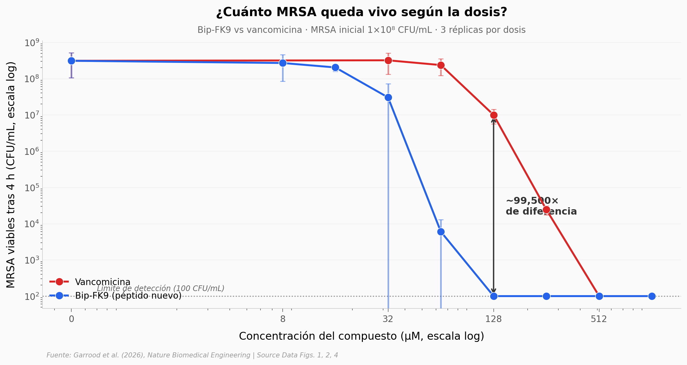

# Un péptido modular contra MRSA — 99,500× más potente que vancomicina

El antibiótico más vendido del mundo deja vivas casi 10 millones de bacterias por mililitro a una concentración donde el péptido nuevo deja 100. Y eso es solo el principio: el ancla específica (un grupo bifenilo) cambia el resultado de un screening de 8 variantes, el lípido PG es el blanco molecular probado, y la versión inhalada cura una neumonía MRSA en ratones.

**El hallazgo:** **A 128 μM, Bip-FK9 deja MRSA en el límite de detección (100 CFU/mL) mientras vancomicina deja 9.95 millones de CFU/mL — una diferencia de ~99,500×.**

## Gráfica clave



## Reproducir

[](https://colab.research.google.com/github/Ciencia-a-Mordiscos/lab/blob/main/papers/2026-05-20-peptide-nanofibres-antimicrobial/notebook.ipynb)

O localmente:
```bash
pip install pandas matplotlib numpy
jupyter execute notebook.ipynb
```

## Datos

- `datos/screening_variantes.csv` — 24 filas. CFU/mL post 24 h de incubación con 7 variantes peptídicas (FK9 + 6 anclas) y Control, 3 réplicas, 8 μM peptídico, MRSA inicial 5×10⁵ CFU/mL.
- `datos/dosis_respuesta.csv` — 48 filas. CFU/mL de MRSA tras 4 h de incubación con vancomicina o Bip-FK9 a 9 concentraciones (0-1024 μM), 3 réplicas. MRSA inicial 1×10⁸ CFU/mL.
- `datos/especificidad_lipidos.csv` — 30 filas. Efecto de lípidos bacterianos libres (Lysyl-PG, CL, PA, PG) como decoys sobre la actividad de Bip-FK9, 3 réplicas, MRSA 2×10⁸ CFU/mL.
- `datos/in_vivo_dosis.csv` — 21 filas. Carga bacteriana pulmonar (% del control) en ratones con neumonía MRSA tras Bip-FK9 inhalado a 7 dosis (0.5–24 μg/mL), 3 ratones por dosis.

## Links

- **Video:** [Pendiente]
- **Paper:** [Nature Biomedical Engineering — DOI: 10.1038/s41551-026-01680-0](https://doi.org/10.1038/s41551-026-01680-0)
- **Datos originales:** [Supplementary Information del paper (MOESM12, 13, 14, 16)](https://www.nature.com/articles/s41551-026-01680-0)
