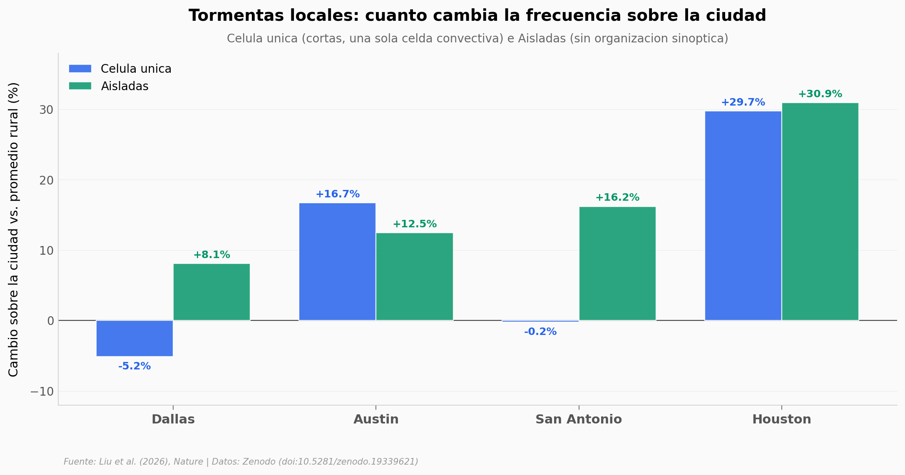

# Tormentas urbanas en Texas: la ciudad las parte en dos

Texas, 1995-2017. Cuatro ciudades. Más de 40.000 tormentas registradas por radar. Cuando los autores las clasifican por tipo, sale un patrón limpio: la ciudad **fabrica** tormentas locales pequeñas, y **debilita** los frentes fríos que llegan desde afuera.

**El hallazgo:** Las tormentas locales (célula única + aisladas) aumentan entre **+7% y +31%** sobre tres ciudades, con pico al atardecer-noche. Los frentes fríos, en cambio, pierden entre **-11.5% y -17.8%** de su intensidad a baja altitud al cruzar la ciudad.

## Gráfica clave



## Reproducir

[](https://colab.research.google.com/github/Ciencia-a-Mordiscos/lab/blob/main/papers/2026-05-20-tormentas-urbanas-texas/notebook.ipynb)

O localmente:
```bash
pip install pandas matplotlib numpy
jupyter execute notebook.ipynb
```

## Datos

- `datos/storm_count_pct.csv` — Cambio porcentual de conteo de tormentas (urbano vs. promedio rural), por ciudad × tipo (20 filas).
- `datos/urban_storm_hour.csv` — Ciclo horario UTC de tormentas, por ciudad × tipo × dominio (2.400 filas).
- `datos/cold_front_profile.csv` — Perfil vertical (12 niveles de altura, 1-12 km) de fracción de píxeles ≥40 dBZ en frentes fríos, urbano vs. rural (240 filas).
- `datos/storm_pixelnum_monthly.csv` — Conteo mensual de píxeles ≥40 dBZ por ciudad × tipo (100 filas).

Todos extraídos del repositorio Zenodo del paper (archivos `pickle` originales convertidos a CSV).

## Links

- **Video:** Pendiente
- **Paper:** [Nature — DOI: 10.1038/s41586-026-10479-7](https://doi.org/10.1038/s41586-026-10479-7)
- **Datos originales:** [Zenodo (Liu et al.)](https://doi.org/10.5281/zenodo.19339621)
