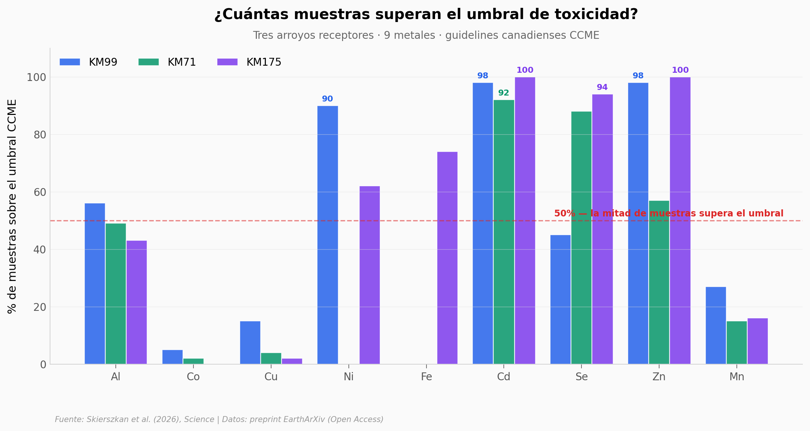

# Cuando el permafrost se derrite y los arroyos se vuelven ácido sulfúrico

En la última década, decenas de surgencias ácidas brotaron en cabeceras de ríos del Yukon ártico. Donde antes había musgo y arbustos, ahora hay tierra muerta y agua color óxido. No son fugas de minas — son los propios sulfuros del subsuelo, expuestos por un permafrost que se derrite, oxidándose al aire por primera vez en milenios. El resultado: pH 2.7 (tan ácido como el vinagre), concentraciones de cadmio y zinc por encima del umbral canadiense de toxicidad en hasta el 100% de las muestras, y un sulfato que sube de forma sostenida en los ríos grandes corriente abajo.

**El hallazgo:** En 3 arroyos receptores del área Tombstone-Wernecke-Ogilvie (Yukon), el cadmio supera el umbral de toxicidad CCME en 92–100% de las muestras y el zinc en hasta el 100%. La fuente puntual son 10 surgencias activas con pH mediano de 3.1 — el mismo rango del drenaje ácido de minas, pero generadas naturalmente.

## Gráfica clave



## Reproducir

[](https://colab.research.google.com/github/Ciencia-a-Mordiscos/lab/blob/main/papers/2026-05-21-acidificacion-arroyos-permafrost/notebook.ipynb)

O localmente:

```bash
pip install pandas matplotlib numpy scipy
jupyter execute notebook.ipynb
```

## Datos

- `datos/streams_concentraciones.csv` — Table S1 del preprint: 30 filas, 9 metales + sulfato × 3 arroyos (KM99, KM71, KM175), con mediana/mín/máx/n/%exceedance CCME.
- `datos/seepages_quimica.csv` — Figura S8F: química de 10 surgencias activas en 4 sitios (pH, conductividad, SO₄, 9 metales).
- `datos/rios_grandes.csv` — Tasas de aumento de sulfato en 3 ríos tributarios (Peel, Ogilvie, Klondike), datos ECCC 1979–2025.
- `datos/streams_impactados_distribucion.csv` — Distribución por tamaño de cuenca de los 130 arroyos SMO-impactados.
- `datos/dawson_temperatura_resumen.csv` — Tasa de calentamiento en Dawson City: +0.04 °C/año, p<0.001 (1961–2024).
- `datos/km99_perfil_espacial.csv` — Perfil pH a lo largo del arroyo KM99: upstream (8.0) → surgencia (2.7) → 3 km downstream (6.7).

## Links

- **Video:** [Pendiente]
- **Paper:** [Skierszkan et al. (2026), Science — DOI: 10.1126/science.aea2898](https://doi.org/10.1126/science.aea2898)
- **Preprint Open Access (fuente real de extracción):** [EarthArXiv — DOI: 10.31223/X5Q44T](https://doi.org/10.31223/X5Q44T)
- **Datos originales (Dryad):** [DOI: 10.5061/dryad.cnp5hqcj0](https://doi.org/10.5061/dryad.cnp5hqcj0)
