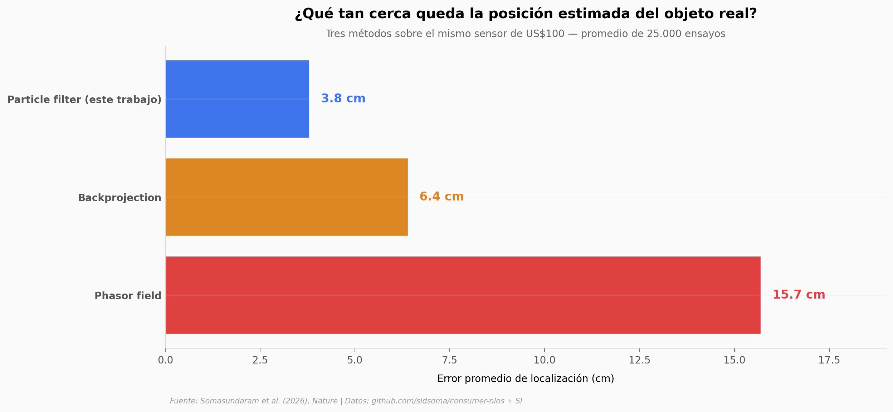

# LiDAR de US$100 ve detrás de las paredes

Un sensor multizone de tiempo de vuelo (ST VL53L8CX) que cabe en una uña y cuesta menos de US$100 reconstruyó la posición de objetos ocultos detrás de una pared con un error promedio de 3,8 cm. Hasta este paper, hacer ese tipo de imagen requería LiDARs científicos de muchos miles de dólares.

**El hallazgo:** **El método propuesto logra 3,8 cm de error promedio sobre 25.000 ensayos — 1,7× mejor que backprojection y 4,1× mejor que phasor field**, los dos baselines clásicos del campo de NLOS imaging.

## Gráfica clave



## Reproducir

[](https://colab.research.google.com/github/Ciencia-a-Mordiscos/lab/blob/main/papers/2026-05-21-lidar-objetos-ocultos-celular/notebook.ipynb)

O localmente:
```bash
pip install pandas matplotlib numpy
jupyter execute notebook.ipynb
```

## Datos

- `datos/errores_baselines.csv` — Error promedio por método (3 filas, valores literales del Supplementary § 5.1).
- `datos/errores_por_dimension.csv` — Errores X/Y/Z para Patch 25×25 y "U" 40×45, con/sin forma conocida (4 filas, del SI).
- `datos/histograma_spad_frame0.csv` — Histograma de fotones del SPAD para 1 cuadro: 128 bins × 16 píxeles. Derivado de `st_spad_person_tracking/volume_000000.npz` del repositorio del paper.
- `datos/trayectoria_tracking.csv` — Trayectoria estimada por el particle filter: 475 cuadros (≈95 s a 5 fps), con media y desviación estándar XYZ de las 1.000 partículas por cuadro.

## Links

- **Video**: [Pendiente]
- **Paper**: [Nature — DOI: 10.1038/s41586-026-10502-x](https://doi.org/10.1038/s41586-026-10502-x)
- **Datos originales**: [github.com/sidsoma/consumer-nlos](https://github.com/sidsoma/consumer-nlos)
- **Supplementary Information**: [Springer Nature]( https://static-content.springer.com/esm/art%3A10.1038%2Fs41586-026-10502-x/MediaObjects/41586_2026_10502_MOESM1_ESM.pdf)
