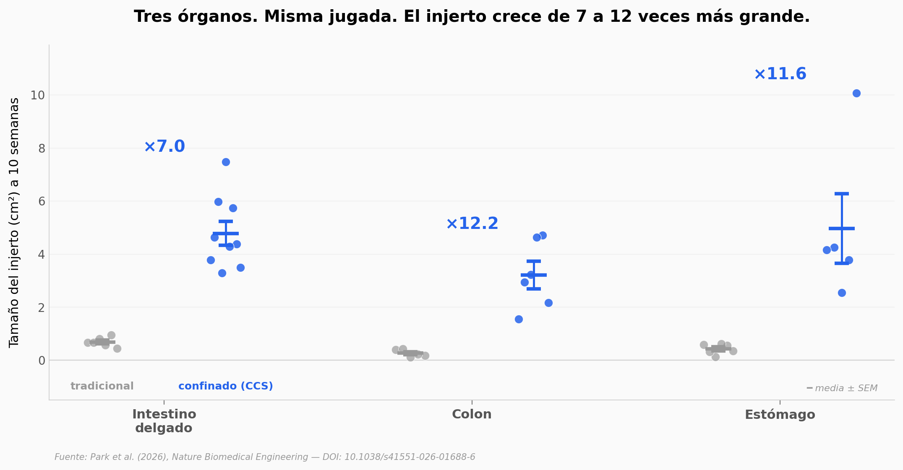

# Hicieron crecer un intestino humano de 8 cm. En 10 semanas.

Y no es solo un tubo de células. Es un tejido intestinal con su propio sistema nervioso entérico — el que controla la contracción, late solo, responde a fármacos. Hasta hoy, para llegar a eso había que ensamblar los nervios a mano. El equipo encontró un atajo: confinar el crecimiento físicamente y dejar que el sistema nervioso se desarrolle solo.

**El hallazgo:** Organoides de **7 a 12 veces más grandes** según el órgano (intestino delgado, colon, estómago) — con sistema nervioso entérico funcional confirmado por tres bloqueos farmacológicos en serie (TTX → L-NAME → atropina).

## Gráfica clave



## Reproducir

[](https://colab.research.google.com/github/Ciencia-a-Mordiscos/lab/blob/main/papers/2026-05-22-organoides-intestino-funcional-ens/notebook.ipynb)

O localmente:
```bash
pip install pandas matplotlib numpy scipy
jupyter execute notebook.ipynb
```

## Datos

Todos los archivos vienen del Source Data publicado con el paper en Nature Biomedical Engineering.

- `datos/fig1f_graft_size_intestino_delgado.csv` — Tamaño de injerto (cm²) a 10 semanas, intestino delgado: HIO (n=6) vs SI CCS (n=9)
- `datos/fig5c_graft_size_colon.csv` — Tamaño de injerto, colon: HCO (n=5) vs C CCS (n=6)
- `datos/fig5f_graft_size_estomago.csv` — Tamaño de injerto, estómago: HaGO (n=6) vs G CCS (n=5)
- `datos/fig3b_amplitud_contractil.csv` — Amplitud contráctil basal, 3 condiciones
- `datos/fig3f_ttx_si_ccs.csv` — TTX pareado (mismas muestras pre/post, n=8)
- `datos/fig3g_farmacologia_si_ccs.csv` — L-NAME y L-NAME+atropina (n=8 por condición)
- `datos/fig6j_fitc_flux_barrera.csv` — FITC-dextrán flux, sham (n=3) vs tie-in (n=4)
- `datos/ext_data_1j_crypt_depth.csv` — Profundidad de criptas (µm), n=4 vs 4
- `datos/ext_data_1k_villus_height.csv` — Altura de vellosidades (µm), n=4 vs 4
- `datos/ext_data_1l_muscle_thickness.csv` — Grosor de músculo liso (µm), n=4 vs 4

## Links

- **Video:** [Pendiente]
- **Paper:** [Nature Biomedical Engineering — DOI: 10.1038/s41551-026-01688-6](https://doi.org/10.1038/s41551-026-01688-6)
- **Datos originales:** Supplementary Materials del paper (Source Data Fig 1f, 3f, 3g, 5c, 5f, 6j, Extended Data Fig 1j-l)
