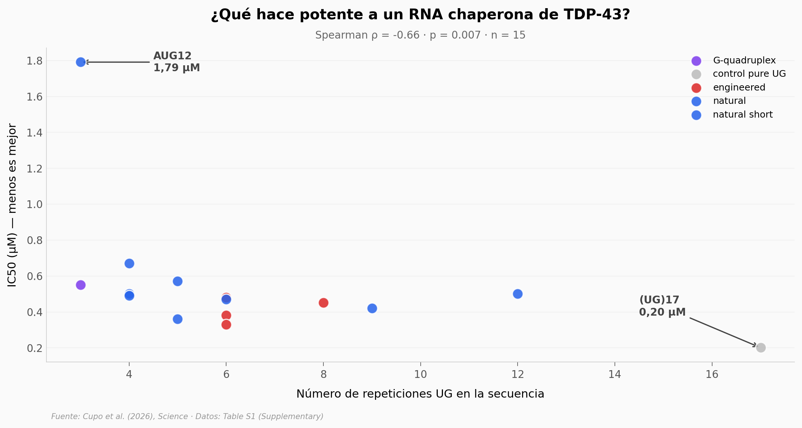

# RNAs que detienen TDP-43

En la ELA y la demencia frontotemporal, una proteína llamada TDP-43 se atasca dentro de las neuronas motoras hasta matarlas. Este paper de Science prueba 17 RNAs cortos como "chaperonas moleculares" — fragmentos que se pegan a TDP-43 y le impiden agregarse. La potencia varía 9× según la secuencia, y el patrón que emerge es más simple de lo que esperarías.

**El hallazgo:** **El número de repeticiones del motivo UG en el RNA predice su potencia chaperona (Spearman ρ = -0,66, p = 0,007, n = 15).** Ni el porcentaje UG ni la estabilidad estructural lo hacen.

## Gráfica clave



## Reproducir

[](https://colab.research.google.com/github/Ciencia-a-Mordiscos/lab/blob/main/papers/2026-05-23-rna-chaperones-tdp-43/notebook.ipynb)

O localmente:
```bash
pip install pandas matplotlib numpy scipy
jupyter execute notebook.ipynb
```

## Datos

- `datos/rna_chaperones_tabla_s1.csv` — Tabla S1 del paper: 17 RNAs con IC50, KD, %UG, número de repeticiones UG, ΔG y tipo (natural/engineered/control).

## Links

- **Video:** [Pendiente]
- **Paper:** [Science · DOI: 10.1126/science.adv3301](https://doi.org/10.1126/science.adv3301)
- **Datos originales:** Supplementary Materials (Tabla S1) del paper
