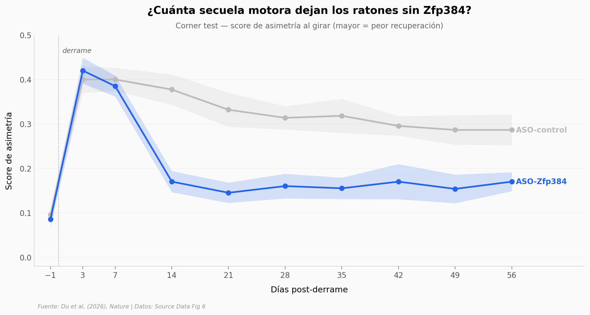

# Frenar UN gen mantiene la microglia reparadora 8 semanas tras un derrame

Tras un derrame cerebral, la microglia entra primero en modo reparador y a los pocos días pasa a un estado dañino que estanca la recuperación. Un equipo de Yale identificó al gen `Zfp384` como el interruptor de ese cambio. Silenciarlo con un fármaco antisentido (ASO) en ratones, 3 días después del derrame, mantiene la microglia en modo reparador y mejora la recuperación motora hasta D56 — dos meses después.

**El hallazgo:** **Cohen's d = 2.16 en el día 14 del Corner test** (p = 0.0006, n = 11 vs 10) y la diferencia se sostiene hasta el día 56. Un efecto de esta magnitud, mantenido 8 semanas tras una sola intervención, es lo inusual.

## Gráfica clave



## Reproducir

[](https://colab.research.google.com/github/Ciencia-a-Mordiscos/lab/blob/main/papers/2026-05-25-microglia-reparativa-stroke-zfp384/notebook.ipynb)

O localmente:
```bash
pip install pandas matplotlib numpy scipy
jupyter execute notebook.ipynb
```

## Datos

- `datos/test_corner_aso.csv` — Corner test (asimetría al girar) en 21 ratones, 10 timepoints (D-1 a D56). 210 mediciones.
- `datos/test_cylinder_aso.csv` — Cylinder test (uso preferente de pata) en los mismos 21 ratones. 210 mediciones.
- `datos/microglia_cell_interactions.csv` — 12 tipos celulares con interacciones moleculares significativas con la microglia reparadora (análisis NicheNet/CellChat).

Todos los datos provienen del Source Data del paper (Fig 6).

## Links

- **Video:** [Ver en YouTube](https://youtube.com/shorts/pCcqcN-FJxo)
- **Paper:** [Nature — DOI: 10.1038/s41586-026-10480-0](https://doi.org/10.1038/s41586-026-10480-0)
- **Datos originales:** [Springer Source Data Fig 6](https://static-content.springer.com/esm/art%3A10.1038%2Fs41586-026-10480-0/MediaObjects/)
