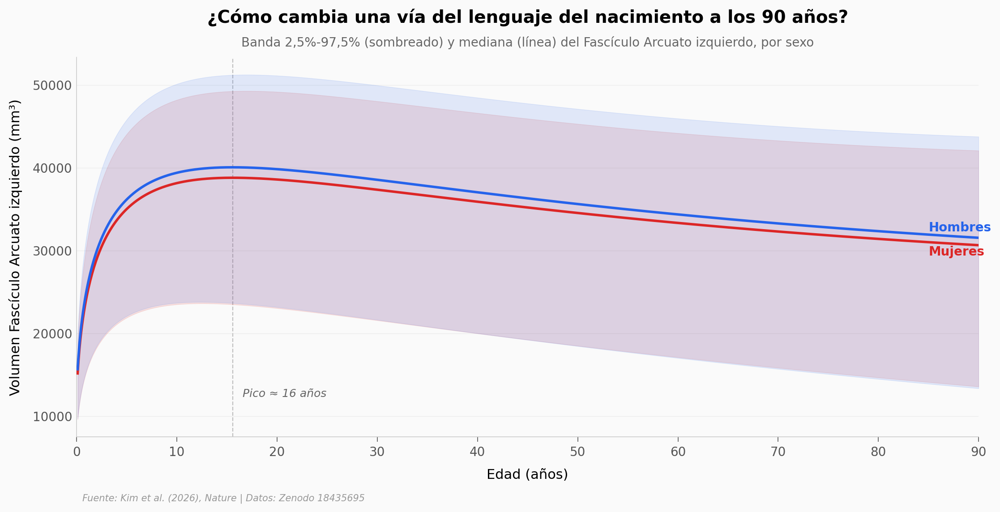

# Tu cerebro tiene 72 autopistas blancas. Ahora hay un mapa de cómo cambian del nacimiento a los 90 años

Un equipo de 36 investigadores procesó **35.120 escáneres cerebrales** de estudios globales y construyó los primeros charts normativos lifespan de **72 vías de sustancia blanca**, de 0 a 100 años. Este notebook explora el chart normativo del Fascículo Arcuato izquierdo y una cohorte clínica de validación con 38 controles sanos y 33 pacientes con esclerosis múltiple.

**El hallazgo:** **El volumen del Fascículo Arcuato izquierdo pica cerca de los 16 años y declina después de los 40, pero NO separa pacientes con MS de controles. La señal clínica vive en la microestructura por tracto: las vías visuales (Radiación Óptica) muestran un efecto grande (Cohen's d ≈ 1,21), mientras que las motoras (cortico-espinal) están preservadas (d = 0,02).**

## Gráfica clave



## Reproducir

[](https://colab.research.google.com/github/Ciencia-a-Mordiscos/lab/blob/main/papers/2026-05-25-white-matter-brain-charts/notebook.ipynb)

O localmente:
```bash
pip install pandas matplotlib numpy scipy
jupyter execute notebook.ipynb
```

## Datos

- `datos/chart_normativo_AF_izq_volumen.csv` — 1.000 puntos de edad (0,1–90 años) con percentiles 2,5/50/97,5 del volumen del Fascículo Arcuato izquierdo por sexo. Derivado de `example_centiles.csv` del repositorio original.
- `datos/cohorte_MS_71participantes.csv` — Cohorte clínica: 38 controles + 33 pacientes con MS, edad, sexo, FA media y volumen en 13 tractos clave.
- `datos/ranking_tractos_efecto_MS.csv` — 72 tractos × FA media (CN, MS), diferencia, Cohen's d, p Mann-Whitney. Computado en este notebook a partir de los datos crudos del repositorio.

## Links

- **Video:** [Ver en YouTube](https://youtube.com/shorts/TRiM-9el2Ro)
- **Paper:** [Nature — DOI: 10.1038/s41586-026-10454-2](https://doi.org/10.1038/s41586-026-10454-2)
- **Datos originales (modelos):** [Zenodo 18435695](https://doi.org/10.5281/zenodo.18435695)
- **Datos originales (derivados completos):** [Zenodo 18891848](https://doi.org/10.5281/zenodo.18891848)
