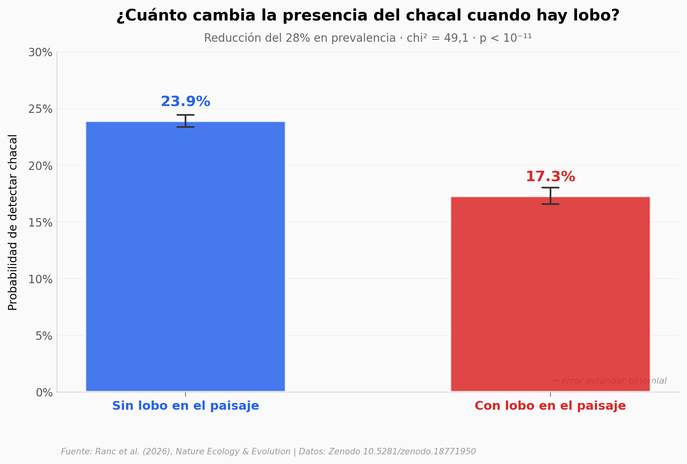

# Chacal dorado en Europa: el lobo lo limita, los humanos lo escudan

El chacal dorado (*Canis aureus*) lleva décadas expandiéndose en Europa. Ranc et al. (2026) compilaron 8.991 muestreos acústicos en 12 países y encontraron que el factor principal que limita su expansión no es el clima ni el bosque: es el lobo gris. En transectos sin lobo, el chacal aparece en uno de cada cuatro muestreos; en transectos con lobo, baja a uno de cada seis. El efecto se concentra en hábitats forestales — donde el lobo tiene ventaja territorial.

**El hallazgo:** **donde hay lobo y bosque, la prevalencia del chacal cae de ~25% a ~10%.** En paisajes abiertos la diferencia casi desaparece. El paper propone que la recuperación de poblaciones de lobo podría reducir hasta un 18% el área potencialmente ocupable por el chacal.

## Gráfica clave



## Reproducir

[](https://colab.research.google.com/github/Ciencia-a-Mordiscos/lab/blob/main/papers/2026-05-26-chacal-dorado-europa/notebook.ipynb)

O localmente:

```bash
pip install pandas matplotlib numpy scipy
jupyter execute notebook.ipynb
```

## Datos

- `datos/surveys.csv` — 8.991 muestreos acústicos individuales (Zenodo, columnas limpias: país, transecto, año, presencia, lobo, bosque, nieve, dist. humanos, dist. agua, duración escucha)
- `datos/jackal_por_lobo.csv` — Prevalencia chacal × wolf_present binario con error estándar
- `datos/wolf_x_forest.csv` — Interacción bosque × lobo (4 bins de cobertura forestal)
- `datos/por_pais.csv` — Agregado por país (12 países)
- `datos/gradiente_humanos.csv` — Quintiles de distancia a humanos × presencia lobo

## Links

- **Video:** [Pendiente]
- **Paper:** [Nature Ecology & Evolution — DOI: 10.1038/s41559-026-03060-y](https://doi.org/10.1038/s41559-026-03060-y)
- **Datos originales:** [Zenodo — 10.5281/zenodo.18771950](https://doi.org/10.5281/zenodo.18771950)
