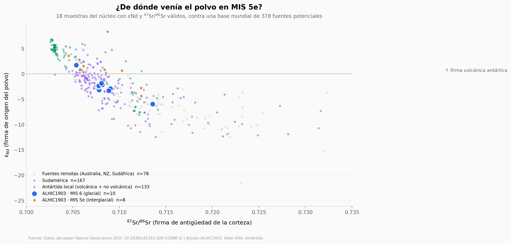

# La Antártida occidental se derritió antes — y dejó su firma en el polvo

Hace 125.000 años el planeta estaba 2-3 °C más cálido que hoy y el mar estaba 5-10 metros más arriba. Una de las grandes preguntas abiertas es qué pasó con la Antártida occidental: ¿se derritió parte de ella? El paper presenta una pista química directa: 22 muestras del núcleo de hielo ALHIC1903 (Allan Hills, Antártida) muestran que el polvo cambió de fuente entre el último glacial (MIS 6) y el último interglacial (MIS 5e).

**El hallazgo:** **el 67% de las muestras MIS 5e cargan firma volcánica antártica local** (ε$_{Nd}$ > 0), frente a solo el 10% en MIS 6 — un cambio de fuente dominante que solo se explica si el Ross Ice Shelf se abrió y reorganizó los vientos cercanos.

## Gráfica clave



## Reproducir

[](https://colab.research.google.com/github/Ciencia-a-Mordiscos/lab/blob/main/papers/2026-05-26-ross-ice-shelf-mis-5e/notebook.ipynb)

O localmente:

```bash
pip install pandas matplotlib numpy scipy
jupyter execute notebook.ipynb
```

## Datos

- `datos/alhic1903_srnd.csv` — 22 muestras Sr/Nd del núcleo (19 con εNd válido, 21 con Sr válido).
- `datos/alhic1903_dust_conc.csv` — 41 mediciones de concentración de polvo (Coulter Counter, 1-20 μm).
- `datos/alhic1903_dD.csv` — 63 mediciones de δD (deuterio, proxy de temperatura local).
- `datos/psa_database.csv` — 381 muestras de referencia de 11 regiones del planeta (Potential Source Areas).

## Links

- **Video:** [Ver en YouTube](https://youtube.com/shorts/A7lJOVGykP0)
- **Paper:** Nature Geoscience (2026) — DOI: [10.1038/s41561-026-01988-1](https://doi.org/10.1038/s41561-026-01988-1)
- **Datos originales:** [Supplementary Material del paper](https://static-content.springer.com/esm/art%3A10.1038%2Fs41561-026-01988-1/MediaObjects/41561_2026_1988_MOESM2_ESM.xlsx) (Source Data XLSX)
