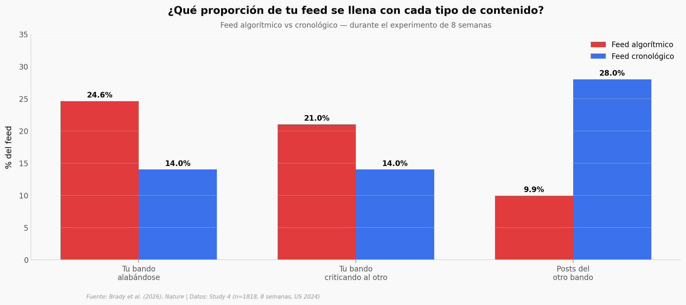

# Algoritmos que distorsionan lo que crees que piensan los demás

Un equipo de Nature construyó dos feeds desde cero —uno ordenado por engagement como las grandes plataformas, otro cronológico simple— y asignó al azar a 1.818 personas a usar uno u otro durante 8 semanas, antes y después de las elecciones de Estados Unidos en 2024. Lo que cambió no fue tanto el comportamiento; lo que cambió fue lo que la gente **creía** que estaba pasando.

**El hallazgo:** El feed algorítmico casi **duplicó** la exposición al contenido del propio bando alabándose (de 14% a 24,6%) y **redujo a un tercio** la exposición al otro bando (de 28% a 9,9%). Esa dieta cambió las creencias: con un efecto medio (Cohen's d = 0,346), la gente del feed algorítmico cree que más personas alaban públicamente a su propio bando.

## Gráfica clave



## Reproducir

[](https://colab.research.google.com/github/Ciencia-a-Mordiscos/lab/blob/main/papers/2026-05-27-algoritmos-redes-percepcion-normas/notebook.ipynb)

O localmente:
```bash
pip install pandas matplotlib numpy scipy
jupyter execute notebook.ipynb
```

## Datos

- `datos/survey_por_participante.csv` — 1.818 filas, una por participante post-exclusión. Outcomes psicométricos completos.
- `datos/exposicion_propio_bando.csv` — % de exposición agregado por condición y categoría (ingroup_praise, outgroup_blame, other_party, neutral, distractor).
- `datos/exposicion_categoria.csv` — % de exposición desglosado por bando (dem/rep × praise/blame).
- `datos/outcomes_resumen.csv` — medias, SE, n, diff, Cohen's d y p-value por outcome.
- `datos/engagement_feed2.csv` — likes y shares agregados por condición.
- `datos/demograficos_por_condicion.csv` — distribución partidista por condición.

Todos derivados de `study4_combined_data.csv` (Supplementary Materials del paper). Filtros: 83 participantes excluidos por `feed_duration < 100 s` o `> 5 NA` en `post_dwell_seconds` — mismo criterio que el script R original de los autores.

## Links

- **Video:** [Pendiente]
- **Paper:** [Nature — DOI: 10.1038/s41586-026-10536-1](https://doi.org/10.1038/s41586-026-10536-1)
- **Datos originales:** Supplementary Materials del paper en Nature

## Notas sobre rigor

El experimento es un RCT con 1.818 participantes — el diseño justifica usar verbos causales como "amplificó" o "redujo". El paper menciona que dos efectos van en dirección **inesperada**: el feed algorítmico **redujo** la percepción de extremismo del entorno (d = −0,19) y **redujo** la polarización afectiva (d = −0,13). Ambos son efectos pequeños pero significativos. El notebook los reporta sin trivializarlos, pero también sin extrapolarlos fuera del diseño experimental.
