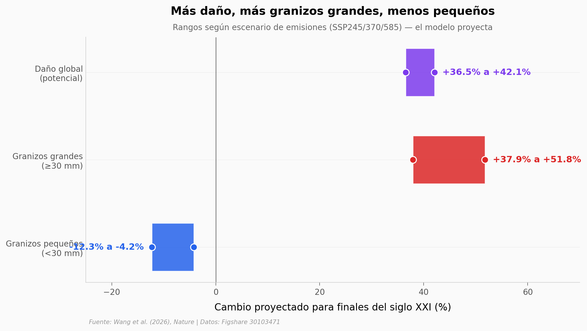

# Granizos más grandes en un clima más cálido

Un modelo global de trayectorias de granizo, alimentado por cinco corridas de EC-Earth3 y tres escenarios de emisiones, proyecta que para finales del siglo XXI el daño económico por granizo subirá entre 36% y 42% a escala global. El cambio no es uniforme: los granizos grandes (≥30 mm) se vuelven más frecuentes, los pequeños se vuelven menos, y las latitudes medias-altas concentran el aumento de daño.

**El hallazgo:** **Los granizos ≥30 mm aumentan 37,9–51,8% en frecuencia, los <30 mm caen 4,2–12,3%, y el daño global por granizo sube 36,5–42,1%** — según el modelo, para finales del s. XXI.

## Gráfica clave



## Reproducir

[](https://colab.research.google.com/github/Ciencia-a-Mordiscos/lab/blob/main/papers/2026-05-27-granizo-global-clima/notebook.ipynb)

O localmente:
```bash
pip install pandas matplotlib numpy
jupyter execute notebook.ipynb
```

## Datos

- `datos/us_diam_histograma_2010_2020.csv` — Distribución de diámetros de granizo observados vs simulados en EEUU, bins de 5 mm (20 bins, 9.462 obs + 4.103 sim).
- `datos/china_obs_anual_1966_1999.csv` — Eventos de granizo observados en China por año (28 años, dos décadas separadas por gap 1980-1985). Muestra el sesgo de densificación de la red de observación.
- `datos/entornos_convectivos_hist_2014_2021.csv` — 3.996 entornos convectivos globales sampleados (lat, lon, MUCAPE, cizalladura 6 km, agua precipitable, altura de fusión). Base histórica del modelo.
- `datos/proyecciones_paper_late21c.csv` — Las 6 cifras cuantitativas del abstract sobre el futuro (rangos según escenario SSP).

## Links

- **Video:** [Pendiente]
- **Paper:** [Nature — DOI: 10.1038/s41586-026-10543-2](https://doi.org/10.1038/s41586-026-10543-2)
- **Datos originales:** [Figshare 30103471 (datos)](https://doi.org/10.6084/m9.figshare.30103471.v3) · [Figshare 30103474 (código)](https://doi.org/10.6084/m9.figshare.30103474.v2) · [Zenodo 18152366 (trayectorias raw)](https://doi.org/10.5281/zenodo.18152366)
