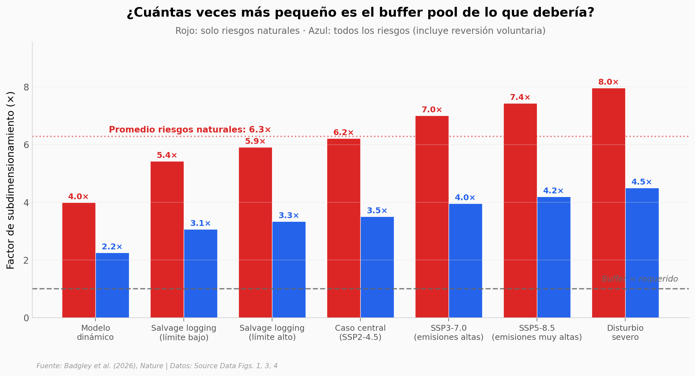

# El buffer del mercado de carbono forestal: probablemente 6,3 veces más pequeño de lo que el clima exige

El mayor programa de bonos de carbono forestal de Estados Unidos —el del California Air Resources Board, CARB— guarda un *buffer pool* para cubrir las pérdidas cuando un bosque se quema o se seca. Un equipo de la *Environmental Defense Fund* y *CarbonPlan* combinó inventario forestal, satélite, modelado de disturbios y machine learning para estimar el riesgo de pérdida de carbono a 100 años en los 95 supersections forestales de Estados Unidos continental, y comparó ese riesgo contra el buffer real que CARB tiene apartado.

**El hallazgo:** **el buffer actual es 6,3 veces más pequeño de lo que el clima exige en promedio, y según el escenario el factor puede ir de 2,2 hasta 8,0.** El fuego, no la sequía ni los insectos, es el disturbio que más responde al cambio climático: pasa del 13% al 35% de probabilidad media en 100 años (+171% relativo). 92 de los 116 proyectos CARB (79%) tienen un riesgo natural total mayor que su buffer asignado.

## Gráfica clave



## Reproducir

[](https://colab.research.google.com/github/Ciencia-a-Mordiscos/lab/blob/main/papers/2026-05-28-buffer-pool-bosques-carbono/notebook.ipynb)

O localmente:
```bash
pip install pandas matplotlib numpy
jupyter execute notebook.ipynb
```

## Datos

- `datos/riesgo_por_ecorregion.csv` — 95 supersections × 6 métricas (fire/drought/insect × histórico/con clima). Fuente: Fig. 1 del paper (Source Data MOESM2).
- `datos/buffer_por_proyecto.csv` — 116 proyectos CARB con buffer asignado vs riesgo natural estimado + breakdown por disturbio. Fuente: Fig. 3d (Source Data MOESM4).
- `datos/escenarios_buffer.csv` — Buffer requerido (con clima vs sin clima) por escenario SSP × cobertura. MtCO₂e. Fuente: Fig. 3e (Source Data MOESM4).
- `datos/factor_subdimensionamiento.csv` — Factor de subdimensionamiento en 7 escenarios de sensibilidad. Fuente: Fig. 4 (Source Data MOESM5).

## Links

- **Video:** [Ver en YouTube](https://youtube.com/shorts/Sn1JsKpcgzQ)
- **Paper:** [Nature — DOI: 10.1038/s41586-026-10571-y](https://doi.org/10.1038/s41586-026-10571-y)
- **Código y datos originales:** [figshare/27988139](https://doi.org/10.6084/m9.figshare.27988139.v1)
