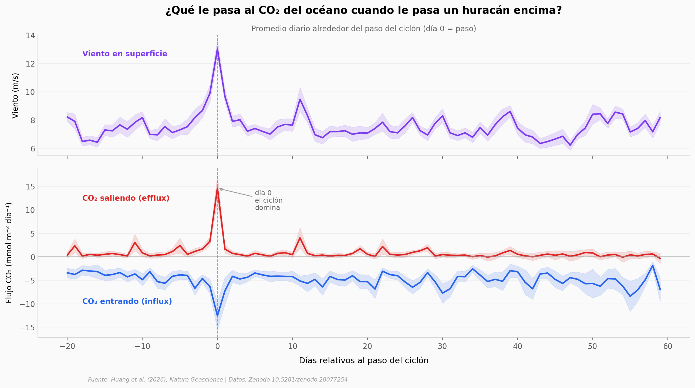

# Los huracanes liberan menos CO₂ del que creíamos

Los ciclones tropicales son las máquinas meteorológicas más violentas que existen sobre agua salada. Cuando pasan, agitan el océano, lo enfrían y mueven cantidades enormes de carbono entre el mar y la atmósfera. Un equipo en China reconstruyó esa huella día a día para 28 años de huracanes y tifones del mundo entero.

**El hallazgo:** Las emisiones globales de CO₂ que los huracanes le sacan al océano **cayeron 44% entre los años 90 y los 2010** — de 0,09 a 0,05 PgC al año. El calentamiento de la superficie del mar, paradójicamente, hizo que las estelas frías que dejan los ciclones absorban más carbono después de su paso.

## Gráfica clave



## Reproducir

[](https://colab.research.google.com/github/Ciencia-a-Mordiscos/lab/blob/main/papers/2026-05-28-ciclones-tropicales-co2-oceano/notebook.ipynb)

O localmente:

```bash
pip install pandas matplotlib numpy scipy
jupyter execute notebook.ipynb
```

## Datos

- `datos/evolucion_tc.csv` — Evolución día a día de viento, ΔpCO₂ y flujos CO₂ desde 20 días antes hasta 60 días después del paso de un ciclón promedio (80 puntos)
- `datos/tendencia_anual.csv` — Serie temporal 1993-2020 de ΔpCO₂ pre-tormenta por clase: sub-saturada (frías), sobre-saturada (cálidas), promedio (28 años)
- `datos/distribucion_dpco2.csv` — Distribución de probabilidad de ΔpCO₂ observada (1993-2020) vs proyectada bajo escenarios CMIP de alta emisión (321 bins)

## Links

- **Video:** [Ver en YouTube](https://youtube.com/shorts/UQWyiyVUKPo)
- **Paper:** [Nature Geoscience — DOI: 10.1038/s41561-026-01985-4](https://doi.org/10.1038/s41561-026-01985-4)
- **Datos originales:** [Zenodo — hxyocean/TC-carbon-fluxes](https://doi.org/10.5281/zenodo.20077254)
