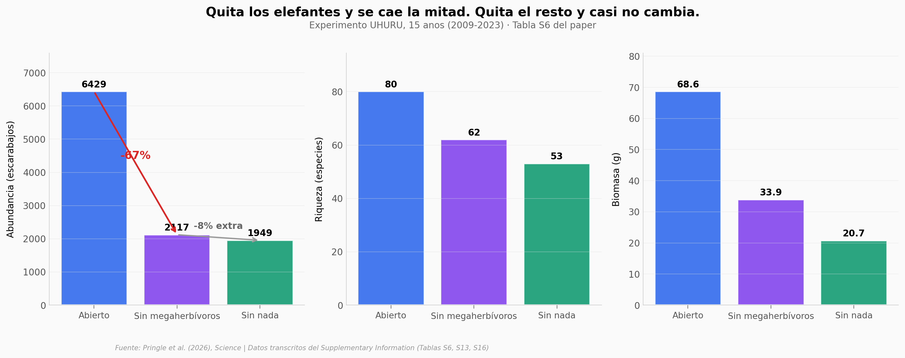

# Quita los elefantes: pierdes el 67% de los escarabajos peloteros

Un experimento de 15 años en Kenia muestra que sin elefantes, las parcelas pierden dos de cada tres escarabajos peloteros y la mitad de la biomasa. Sin el resto de herbívoros silvestres, el efecto adicional es casi cero. La métrica de centralidad de red coincide con el resultado experimental: el elefante atrae a 88 especies de escarabajos — la cebra, segunda en el podio, atrae a 63.

**El hallazgo:** **Excluir elefantes durante 15 años redujo la abundancia de escarabajos peloteros en −67% y la biomasa en −51%. Excluir además al resto de herbívoros añadió solo −8% extra en abundancia (no significativo).**

## Gráfica clave



## Reproducir

[](https://colab.research.google.com/github/Ciencia-a-Mordiscos/lab/blob/main/papers/2026-05-28-elefantes-escarabajos-keystone-mpala/notebook.ipynb)

O localmente:
```bash
pip install pandas matplotlib numpy scipy
jupyter execute notebook.ipynb
```

## Datos

- `datos/herbivoros_dung.csv` — 9 actores (8 herbívoros + humano) con métricas de centralidad de red y community importance
- `datos/exclusion_experimento.csv` — 3 tratamientos UHURU (Abierto / Sin megaherbívoros / Sin nada) con abundancia, riqueza, biomasa
- `datos/sitios_comparacion.csv` — Mpala / Koija / Lekiji con abundancia predicha por GLMM (Tabla S13)
- `datos/keystone_metrics.csv` — community importance per capita por grupo (Tabla S16)
- `datos/red_centralidad.csv` — métricas agregadas elefante vs promedio del resto

## Links

- **Video:** Pendiente
- **Paper:** [*Science* — DOI: 10.1126/science.aeb7062](https://doi.org/10.1126/science.aeb7062)
- **Datos originales:** Supplementary Information del paper (Tablas S6, S13, S16). El dataset Dryad asociado ([10.5061/dryad.9p8cz8wwn](https://doi.org/10.5061/dryad.9p8cz8wwn)) estaba embargado al momento de generar este notebook.
