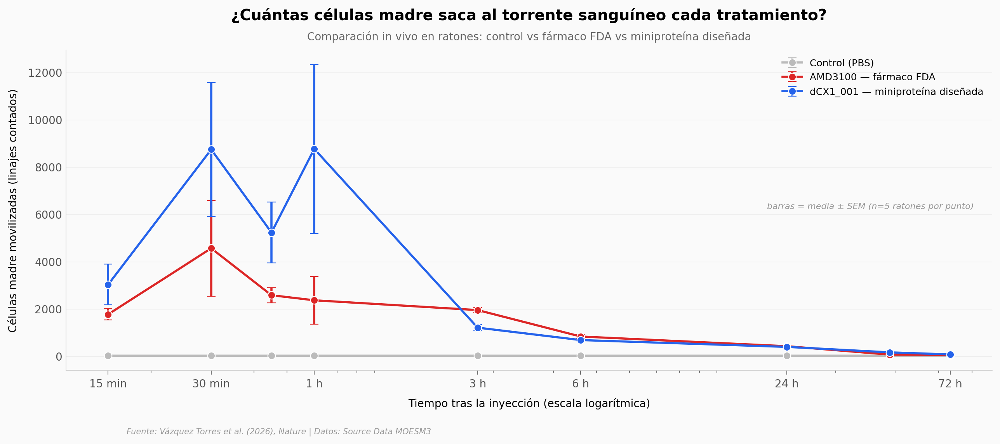

# Diseñaron una proteína desde cero. Funcionó en un ratón vivo.

Tomaron un computador, lo apuntaron a un receptor que vive en la superficie de las células humanas, y le dijeron: *hazme una proteína nueva que se pegue a esto y lo active*. Lo que salió funcionó — no solo en un tubo de ensayo, también en ratones vivos, moviendo células madre tan bien (o mejor) que el fármaco aprobado por la FDA.

**El hallazgo:** una miniproteína de ~70 aminoácidos diseñada de novo (sin parecido evolutivo a nada natural) **bloquea el receptor CXCR4 al 100 por ciento** in vitro a 1 µM, y **moviliza células madre hematopoyéticas en ratones con un fold-change mediano de 1.7× respecto al fármaco FDA Mozobil** (AMD3100).

## Gráfica clave



## Reproducir

[](https://colab.research.google.com/github/Ciencia-a-Mordiscos/lab/blob/main/papers/2026-05-28-miniproteinas-gpcr-diseno-de-novo/notebook.ipynb)

O localmente:

```bash
pip install pandas matplotlib numpy scipy
jupyter execute notebook.ipynb
```

## Datos

Cinco CSVs extraídos del Source Data MOESM3 del paper (Nature):

- `datos/hsc_mobilization_timecourse.csv` — 135 mediciones · 9 timepoints (15 min a 72 h) × 3 grupos (Control, AMD3100, dCX1_001) × 5 ratones por punto.
- `datos/hsc_pairwise_stats.csv` — comparaciones pareadas del paper (Sidak corregido para 18 comparaciones, con IC al 95 por ciento y p ajustados).
- `datos/cxcr4_antagonism.csv` — 96 mediciones in vitro · 8 dosis de CXCL12 × 3 condiciones (sin antagonista, dCX1_001 a 300 nM, dCX1_001 a 1 µM) × 4 réplicas.
- `datos/mrgprx1_dose_response.csv` — dosis-respuesta de miniproteínas agonistas en receptor MRGPRX1 (no usado en el análisis principal del notebook).
- `datos/glp1r_gipr_dose_response.csv` — dosis-respuesta para GLP1R y GIPR (idem).

## Links

- **Video:** [Ver en YouTube](https://youtube.com/shorts/4L6OKRbUD6g)
- **Paper:** [Vázquez Torres et al. (2026), *Nature* — DOI: 10.1038/s41586-026-10656-8](https://doi.org/10.1038/s41586-026-10656-8)
- **Datos originales:** [Source Data MOESM3 (Nature, Supplementary)](https://static-content.springer.com/esm/art%3A10.1038%2Fs41586-026-10656-8/MediaObjects/41586_2026_10656_MOESM3_ESM.xlsx)
