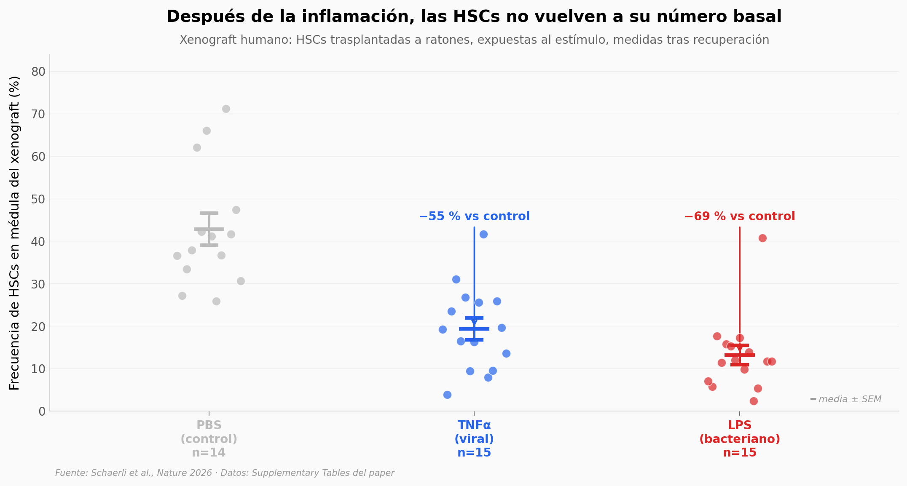

# Memoria inflamatoria en células madre humanas

¿Una infección que ya pasó deja huella en las células que fabrican tu sangre? El paper trasplantó células madre hematopoyéticas humanas (HSCs) a ratones, las expuso a TNFα o LPS, esperó la recuperación — y encontró dos subpoblaciones. Una de ellas, **HSC-iM**, conserva una memoria inflamatoria persistente y aparece amplificada en condiciones humanas de estrés medular (hematopoyesis clonal, post-COVID, envejecimiento). El programa llega a la sangre que circula.

**El hallazgo:** **TNFα redujo la frecuencia de HSCs un 55 % y LPS un 69 % (Cohen's d = 1,9 y 2,5)** en xenografts humanos — y las sobrevivientes incluyen una subpoblación con huella inflamatoria que se enriquece +49 % en personas con hematopoyesis clonal (p = 0,017, n = 13).

## Gráfica clave



## Reproducir

[](https://colab.research.google.com/github/Ciencia-a-Mordiscos/lab/blob/main/papers/2026-05-29-celulas-madre-memoria-inflamatoria/notebook.ipynb)

O localmente:

```bash
pip install pandas matplotlib numpy scipy
jupyter execute notebook.ipynb
```

## Datos

- `datos/hsc_frecuencia_inflamacion.csv` — 44 mediciones (3 donantes × PBS/TNFα/LPS), frecuencia de HSCs en médula del xenograft tras recuperación (Fig 1g).
- `datos/firma_lthsc_por_subset.csv` — 12 filas, score de firma LT-HSC en RNA-seq y ATAC-seq por subset HSC/MPP/LMPP (Fig 2c/2d).
- `datos/clonal_haematopoiesis_hscim.csv` — 13 sujetos (4 controles + 9 con CH mutante: 3 TET2, 5 DNMT3A, 1 doble), HSC-iM AUC mediana y fracción de células mutantes en médula (Fig 4h).
- `datos/hscim_sangre_periferica_efectos.csv` — 24 contrastes, effect sizes de los programas HSC-I y HSC-iM en sangre periférica de cohortes joven y mayor (Fig 5j).

## Links

- **Video:** [Ver en YouTube](https://youtube.com/shorts/vNq46Ohz2VE)
- **Paper:** [Nature — DOI: 10.1038/s41586-026-10522-7](https://doi.org/10.1038/s41586-026-10522-7)
- **Datos originales:** Supplementary Tables del paper ([MOESM5](https://static-content.springer.com/esm/art%3A10.1038%2Fs41586-026-10522-7/MediaObjects/41586_2026_10522_MOESM5_ESM.xlsx), [MOESM6](https://static-content.springer.com/esm/art%3A10.1038%2Fs41586-026-10522-7/MediaObjects/41586_2026_10522_MOESM6_ESM.xlsx), [MOESM8](https://static-content.springer.com/esm/art%3A10.1038%2Fs41586-026-10522-7/MediaObjects/41586_2026_10522_MOESM8_ESM.xlsx), [MOESM9](https://static-content.springer.com/esm/art%3A10.1038%2Fs41586-026-10522-7/MediaObjects/41586_2026_10522_MOESM9_ESM.xlsx))
