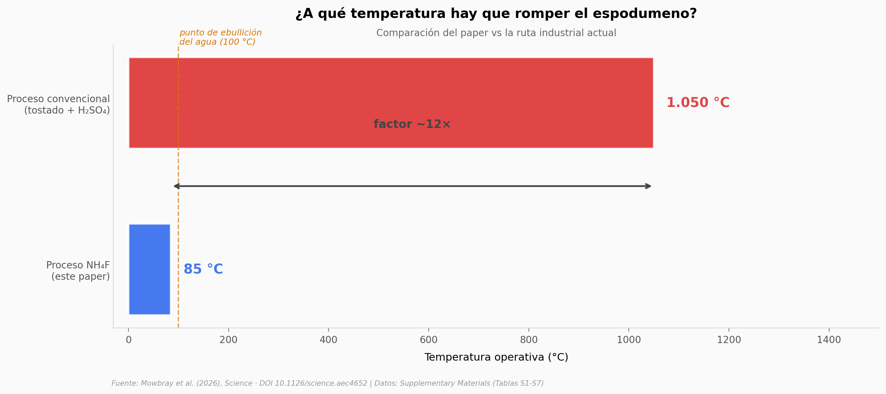

# Litio para baterías sin tostar la roca

Para sacar litio de espodumeno — el mineral más abundante de litio — la industria actual lo tuesta a más de 1.000 °C, lo ataca con ácido sulfúrico concentrado, y deja residuos sólidos sin valor comercial. Un equipo del MIT y Rock Zero acaba de demostrar otra vía: usar fluoruro de amonio (NH₄F) en agua, a menos de 100 °C, en un circuito que regenera el reactivo. El proceso saca litio, alúmina y sílice de la misma roca, y los 3 son comercializables.

**El hallazgo:** **El proceso opera a <100 °C en vez de >1.000 °C, recupera 99% del litio en 17 muestras de 4 países, y produce Li₂CO₃ grado batería con pureza equivalente al estándar comercial.** El análisis técnico-económico *sugiere* que podría reducir el costo de producir litio en más del 40% — pero esa parte es proyección, no medición.

## Gráfica clave



## Reproducir

[](https://colab.research.google.com/github/Ciencia-a-Mordiscos/lab/blob/main/papers/2026-05-29-spodumene-litio-bajo-temperatura/notebook.ipynb)

O localmente:
```bash
pip install pandas matplotlib numpy
jupyter execute notebook.ipynb
```

## Datos

- `datos/yields_experimento_principal.csv` — 6 productos/intermediarios del proceso, rendimiento y pureza.
- `datos/process_generality.csv` — 17 muestras de Australia, USA, Brasil y Canadá, con grados Li₂O de 0,8% a 7,2%.
- `datos/reaction_thermodynamics.csv` — 11 reacciones balanceadas del circuito cerrado, ΔH° en kJ/mol.
- `datos/feedstock_composition.csv` — 36 elementos del espodumeno feedstock (11 mayores + 25 menores).
- `datos/alumina_purity.csv` — 39 óxidos analizados en el Al₂O₃ por activación neutrónica (12 por debajo del límite de detección).
- `datos/tea_parameters.csv` — Parámetros TEA del proceso NH₄F vs el incumbente H₂SO₄ (head-to-head).
- `datos/sensitivity_inputs.csv` — Rangos low/median/high de los 5 parámetros TEA principales.

## Links

- **Video:** [Pendiente]
- **Paper:** [Science — DOI: 10.1126/science.aec4652](https://doi.org/10.1126/science.aec4652)
- **Datos originales:** [Supplementary Materials (Science, PDF)](https://www.science.org/doi/suppl/10.1126/science.aec4652/suppl_file/science.aec4652_sm.pdf)
