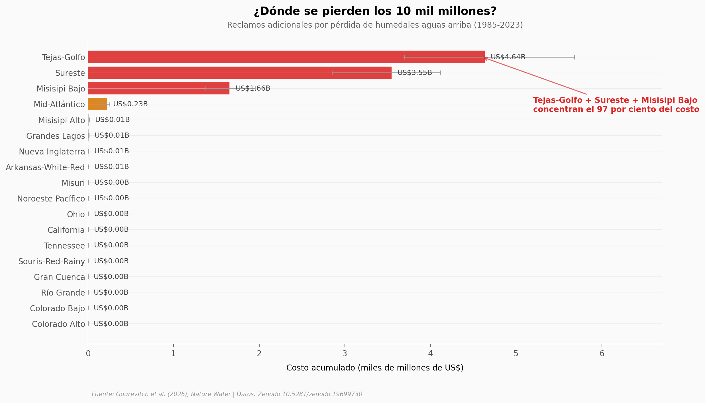

# Humedales aguas arriba: 10 mil millones de dólares en reclamos por inundaciones

Un equipo cruzó 38 años de mapas anuales de humedales en Estados Unidos con cada reclamo del seguro federal de inundaciones (NFIP). Construyeron una regresión de panel con efectos fijos por subcuenca HUC12 — 83.359 unidades — y midieron cuánto cuesta cada hectárea de humedal que desaparece aguas arriba de una propiedad asegurada. El resultado: la pérdida acumulada entre 1985 y 2023 sumó US$10,12 mil millones en reclamos adicionales, equivalentes al 9% del total nacional NFIP del periodo. Pero el dato más interesante no es el total — es la concentración.

**El hallazgo:** **El 0,11% de las subcuencas concentra el 44,6% del costo, y 3 regiones costeras (Tejas-Golfo, Sureste, Misisipi Bajo) acumulan el 97% del daño.**

## Gráfica clave



## Reproducir

[](https://colab.research.google.com/github/Ciencia-a-Mordiscos/lab/blob/main/papers/2026-06-01-humedales-eeuu-inundaciones-economia/notebook.ipynb)

O localmente:
```bash
pip install pandas matplotlib numpy
jupyter execute notebook.ipynb
```

## Datos

- `datos/regiones_huc2.csv` — 18 regiones hidrológicas HUC2, agregado nacional (n, ha de humedal, costo, BCR).
- `datos/cambio_humedales_bins.csv` — 9 bins por magnitud de cambio de humedal, con n y contribución al costo.
- `datos/distribucion_bcr.csv` — 8 rangos logarítmicos de Benefit-Cost Ratio con n de subcuencas en cada uno.
- `datos/sensibilidad_tasa_descuento.csv` — NPV total nacional bajo 5 tasas de descuento (1%, 2%, 3%, 5%, 7%).

Todos derivados del dataset completo de Gourevitch et al. (2026) en Zenodo (172 MB, 83.359 × 218).

## Links

- **Video:** [Pendiente]
- **Paper:** [Nature Water — DOI: 10.1038/s44221-026-00656-3](https://doi.org/10.1038/s44221-026-00656-3)
- **Datos originales:** [Zenodo 10.5281/zenodo.19699730](https://doi.org/10.5281/zenodo.19699730)
