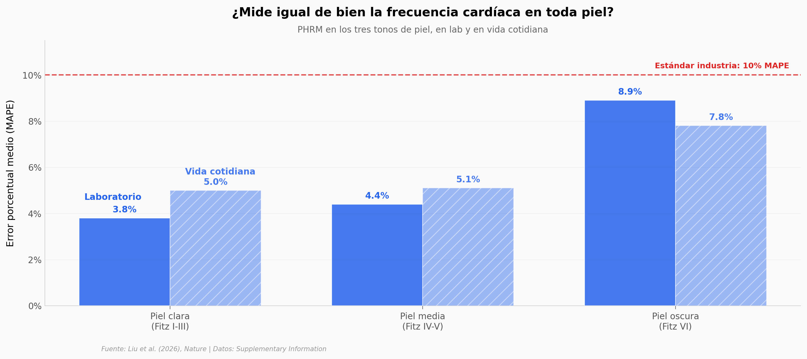

# Tu teléfono ya te toma el pulso

¿Y si tu cara ya delatara tu frecuencia cardíaca sin que lo sepas? Cada vez que abres el celular y miras la pantalla, la cámara frontal capta el rubor que tu pulso le imprime a la piel — esa señal se llama *remote photoplethysmography* (rPPG). El problema histórico: los métodos previos fallaban casi 4× más en piel oscura (MAE 3,4 → 13,6 bpm de Fitzpatrick I-V a VI). Un nuevo modelo de Google Research (**PHRM**) entrenado con 192.353 videos de 485 personas (reclutando deliberadamente ~1/3 con piel Fitzpatrick VI) reporta MAPE <10% en los tres tonos de piel en laboratorio, cumpliendo el estándar industria por primera vez en smartphones.

**El hallazgo:** PHRM logra **MAPE de 3,8% / 4,4% / 8,9%** (piel clara / media / oscura, laboratorio) y **3,2× menos error que Savur** en piel oscura en vida cotidiana — con un modelo de solo 498K parámetros (el más pequeño del benchmark de 8 modelos rPPG).

## Gráfica clave



## Reproducir

[](https://colab.research.google.com/github/Ciencia-a-Mordiscos/lab/blob/main/papers/2026-06-01-monitoreo-pasivo-fc-smartphone/notebook.ipynb)

O localmente:

```bash
pip install pandas matplotlib numpy
jupyter execute notebook.ipynb
```

## Datos

Todos los CSVs vienen del Supplementary Information del paper original (Springer Nature):

- `datos/mape_skin_tone.csv` — MAPE por modelo (PHRM_full + PHRM_mini), condición (lab/free-living) y tono de piel
- `datos/phrm_vs_savur.csv` — Comparación contra el método rPPG de referencia previo
- `datos/model_sizes.csv` — Tamaño de los 8 modelos rPPG del benchmark
- `datos/skin_type_distribution.csv` — Distribución Fitzpatrick I-VI del cohorte
- `datos/device_performance.csv` — Latencia y memoria en Pixel 3-7 (2018-2022)
- `datos/activity_distribution.csv` — Distribución de actividades del dataset

## Links

- **Video:** [Ver en YouTube](https://youtube.com/shorts/k70eXJMAZgU)
- **Paper:** [*Nature* — DOI: 10.1038/s41586-026-10507-6](https://doi.org/10.1038/s41586-026-10507-6)
- **Datos originales:** [Supplementary Information del paper](https://www.nature.com/articles/s41586-026-10507-6)
