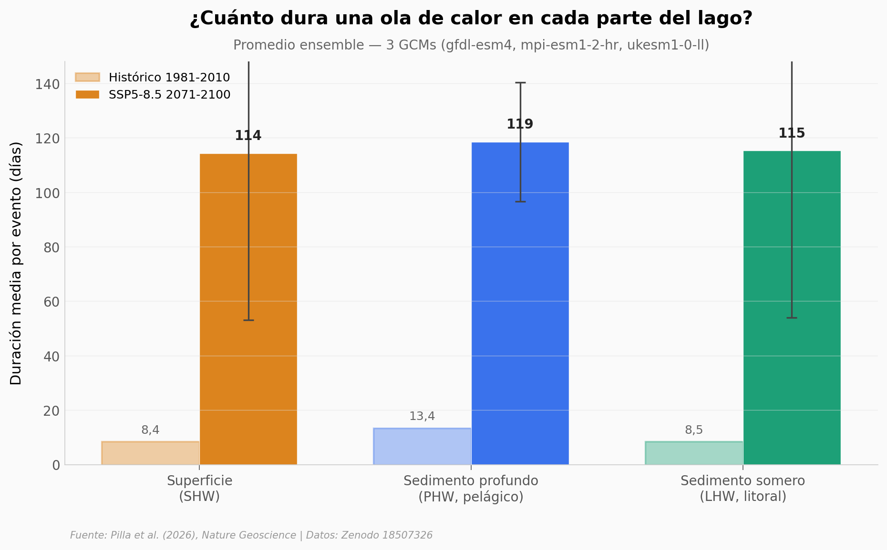

# Olas de calor en el sedimento de los lagos

El fondo profundo de un lago amortigua las anomalías térmicas que llegan desde la superficie — y los autores de este paper en *Nature Geoscience* simularon 41.499 lagos del planeta para ver qué pasa con ese amortiguamiento bajo escenarios de calentamiento. Aquí reproducimos sus análisis con los datos crudos en Zenodo: ensemble de 3 GCMs (de los 5 del paper) × 3 SSPs.

**El hallazgo:** En clima histórico, el sedimento **pelágico** (PHW) ya dura ×1,6 más por evento que la superficie (13,4 vs 8,4 días). Bajo SSP5-8.5, esa duración se proyecta multiplicar por ~9 (118,5 días/evento), y el retardo térmico entre superficie y fondo colapsa de ~22 días a ~1 día. El sedimento **litoral** (LHW), pegado a la orilla, no muestra ese patrón — el matiz pelágico vs litoral importa.

## Gráfica clave



## Reproducir

[](https://colab.research.google.com/github/Ciencia-a-Mordiscos/lab/blob/main/papers/2026-06-01-olas-calor-sedimentos-lagos/notebook.ipynb)

O localmente:
```bash
pip install pandas matplotlib numpy
jupyter execute notebook.ipynb
```

## Datos

- `datos/ensemble_metricas.csv` — agregación ensemble (3 modelos × 3 SSPs × 3 tipos × 7 métricas × hist/fut), 114 filas. Reducido desde 9 NetCDFs (~428 MB en Zenodo) mediante promedio global ponderado por cos(lat).
- `datos/cambios_hist_vs_fut.csv` — pivot del ensemble: cambio absoluto y porcentual hist → fut por SSP × tipo × métrica. 63 filas.
- `datos/ensemble_bandas.csv` — métricas desagregadas por banda latitudinal (Tropical / Temperada / Subpolar / Polar). 360 filas.

## Links

- **Video:** [Pendiente]
- **Paper:** [*Lake sediment heatwaves under global warming* — Nature Geoscience, junio 2026](https://doi.org/10.1038/s41561-026-01986-3)
- **Datos originales:** [Zenodo 18507326](https://doi.org/10.5281/zenodo.18507326)
- **Forzamiento climático:** [ISIMIP3b protocol](https://www.isimip.org/protocol/3/)
