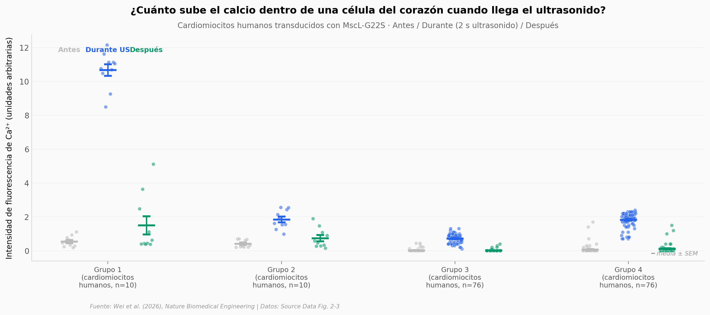

# Un marcapasos sin cirugía: ultrasonido + un canal bacteriano

Un equipo en *Nature Biomedical Engineering* mostró que se puede marcar el ritmo del corazón sin abrir el pecho ni meter electrodos: con un parche de ultrasonido por fuera de la piel y una proteína mecanosensible prestada de una bacteria. Reanalizamos los Source Data del paper (calcio in vitro en cardiomiocitos humanos, dosis-respuesta de presión acústica, intervalos de latido en ratas vivas) y reproducimos los efectos centrales.

**El hallazgo:** **Hasta 29× más calcio dentro de la célula cuando llega el ultrasonido (Cohen's d pareado hasta 9.7), y un 64% de aumento del intervalo entre latidos en rata viva (p ≈ 10⁻⁷, n=35 latidos en 3 trials).**

## Gráfica clave



## Reproducir

[](https://colab.research.google.com/github/Ciencia-a-Mordiscos/lab/blob/main/papers/2026-06-02-marcapasos-ultrasonico-sonogenetico/notebook.ipynb)

O localmente:

```bash
pip install pandas matplotlib numpy scipy
jupyter execute notebook.ipynb
```

## Datos

- `datos/calcio_in_vitro.csv` — Fluorescencia de Ca²⁺ en 172 cardiomiocitos humanos transducidos con MscL-G22S, columnas `pre / during / post` ultrasonido, 4 grupos experimentales.
- `datos/curva_dosis_respuesta.csv` — 180 mediciones de tasa de éxito del pacing × presión acústica (1.2–2.2 MPa) × duración de pulso (10–80 ms), 6 réplicas por combinación.
- `datos/intervalos_off_on.csv` — 97 latidos de 7 trials de rata in vivo. El notebook usa solo los 3 trials comparables (j, k, n; 35 latidos) — los otros 4 reportan métricas no comparables.

## Links

- **Video corto:** [Pendiente]
- **Paper:** [A wearable non-invasive sonogenetic pacemaker — Nature Biomedical Engineering · DOI: 10.1038/s41551-026-01673-z](https://doi.org/10.1038/s41551-026-01673-z)
- **Datos originales:** Source Data del paper (MOESM11, MOESM12 de Springer Nature)
