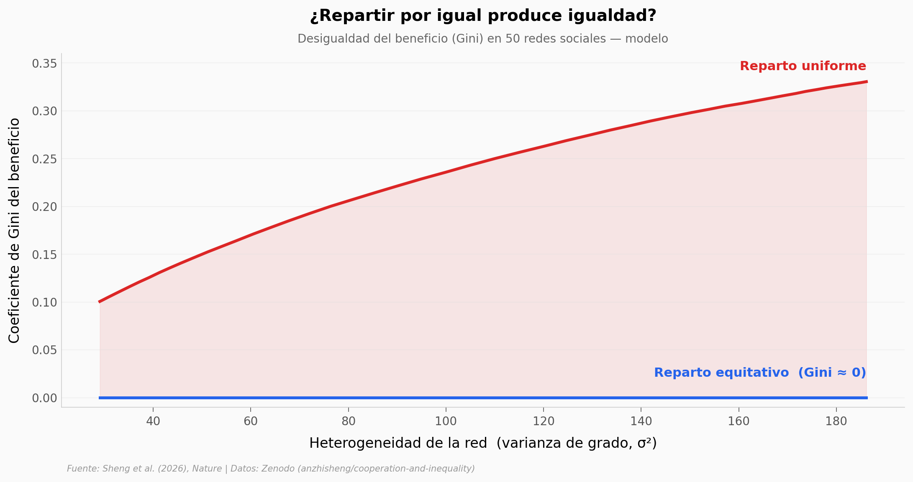

# Cooperación vs. igualdad al repartir bienes públicos

Dar a todos la misma porción de un bien compartido suena a lo más justo que existe. Un modelo de teoría de juegos publicado en *Nature* (junio 2026) encontró que, en una red social, repartir por igual puede ser el camino más rápido para concentrar el beneficio en unos pocos muy conectados — y aun así, ser la mejor forma de que la cooperación se contagie.

**El hallazgo:** el reparto **equitativo** mantiene la igualdad casi perfecta (Gini ≈ 0), pero el reparto **uniforme** facilita más la cooperación en **40 de 50 redes** a costa de triplicar la desigualdad (Gini de 0,10 a 0,33).

## Gráfica clave



## Reproducir

[](https://colab.research.google.com/github/Ciencia-a-Mordiscos/lab/blob/main/papers/2026-06-03-cooperation-equality-public-goods/notebook.ipynb)

O localmente:
```bash
pip install pandas matplotlib numpy
jupyter execute notebook.ipynb
```

## Datos

- `datos/tradeoff_heterogeneidad.csv` — Figura 4 del paper. Trade-off entre cooperación e igualdad en 50 redes (varianza de grado 29–186). Columnas: `degree_variance`, `equitable_bcr`, `uniform_bcr`, `equitable_gini`, `uniform_gini`.
- `datos/payoffs_red_A_left.csv` — red dispersa de ejemplo (50 individuos, grado medio 2). Beneficio neto por persona bajo cada reparto.
- `datos/payoffs_red_B_right.csv` — red densa de ejemplo (50 individuos, grado medio 9,4). Beneficio neto por persona bajo cada reparto.

## Links

- **Video:** [Pendiente]
- **Paper:** [Nature — DOI: 10.1038/s41586-026-10550-3](https://doi.org/10.1038/s41586-026-10550-3)
- **Datos originales:** [Zenodo — anzhisheng/cooperation-and-inequality v1.0.2](https://doi.org/10.5281/zenodo.19166894)
