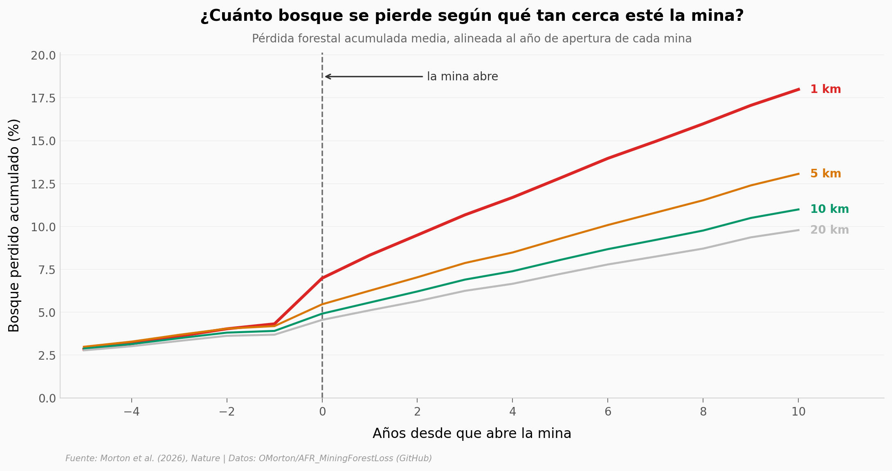

# Minería y deforestación en África subsahariana

La demanda de minerales africanos crece rápido — y con ella la presión sobre el bosque tropical. Un equipo rastreó 16.627 minas con imágenes de satélite (2001-2020) y midió cuánto bosque se pierde *de más* solo por tener una mina al lado.

**El hallazgo:** **por cada hectárea de tala directa, la minería desencadena en promedio 34 hectáreas de pérdida de bosque a su alrededor** en cinco años. El cobalto y el cobre — los minerales de baterías y electrónica — están entre los que más arrasan.

## Gráfica clave



## Reproducir

[](https://colab.research.google.com/github/Ciencia-a-Mordiscos/lab/blob/main/papers/2026-06-03-mineria-deforestacion-africa/notebook.ipynb)

O localmente:
```bash
pip install pandas matplotlib numpy
jupyter execute notebook.ipynb
```

## Datos

- `datos/evento_estudio_distancia.csv` — pérdida forestal acumulada media (%) por años desde la apertura de la mina, por anillo (1/5/10/20 km). 64 filas, ~15.255 clústeres de mina, 29 países.
- `datos/deforestacion_adicional.csv` — doble-diferencia: exceso de cada anillo menos el fondo de 20 km. La fila clave: 1 km @ +10 años = 7,57 pp.
- `datos/comodidades_deforestacion.csv` — deforestación adicional a 1 km tras 10 años por mineral (pp, con IC 95%), del texto Open Access del paper.

## Links

- **Video:** [Pendiente]
- **Paper:** [Nature — DOI: 10.1038/s41586-026-10551-2](https://doi.org/10.1038/s41586-026-10551-2)
- **Datos originales:** [OMorton/AFR_MiningForestLoss (GitHub)](https://github.com/OMorton/AFR_MiningForestLoss)
