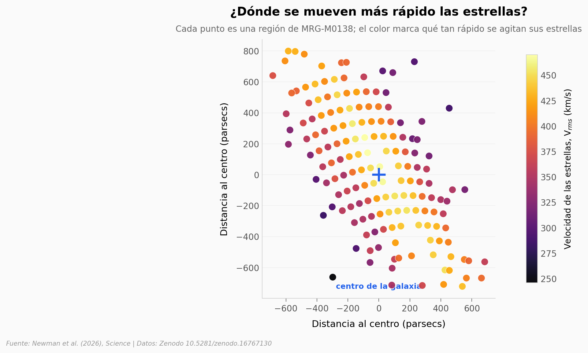

# Un agujero negro de 6.000 millones de soles, visto cuando el universo era joven

El telescopio James Webb midió la masa de un agujero negro en una galaxia tan lejana que su luz salió hace unos 10.300 millones de años. El truco: una lente gravitacional amplió la imagen lo suficiente para asomarse a su corazón, y al estar el agujero negro inactivo, la luz de las estrellas llegó limpia para medir cómo se mueven.

**El hallazgo:** El agujero negro inactivo de MRG-M0138 (a *redshift* 1,95) pesa **6,0 ⁺²·¹₋₁·₇ × 10⁹ masas solares** — rivaliza con M87*, pero lo vemos cuando el universo tenía un cuarto de su edad actual. Su firma: las estrellas del centro se mueven un ~21% más rápido que las de las afueras.

## Gráfica clave



## Reproducir

[](https://colab.research.google.com/github/Ciencia-a-Mordiscos/lab/blob/main/papers/2026-06-04-masa-agujero-negro-redshift-2/notebook.ipynb)

O localmente:
```bash
pip install pandas matplotlib numpy
jupyter execute notebook.ipynb
```

> **Nota:** este notebook reproduce el *observable* que restringe la masa (el campo de velocidades V_rms y su subida central), no la masa en sí. El valor de 6×10⁹ masas solares proviene de modelos dinámicos del paper que corren en un clúster de cómputo.

## Datos

- `datos/kinematics_bins.csv` — V, σ y V_rms en 219 bins Voronoi (210 válidos) con coordenadas en el plano fuente y radio en pc.
- `datos/perfil_radial.csv` — perfil radial de V_rms en 8 anillos log-espaciados (muestra la subida central).
- `datos/perfil_mge.csv` — descomposición MGE del brillo (F200W) y la masa estelar (Tabla S1 del paper).

## Links

- **Video:** [Ver en YouTube](https://youtube.com/shorts/vdCKhEI9ZuM)
- **Paper:** [Science — DOI: 10.1126/science.adx5816](https://doi.org/10.1126/science.adx5816)
- **Datos originales:** [Zenodo (Newman 2026)](https://doi.org/10.5281/zenodo.16767130)
