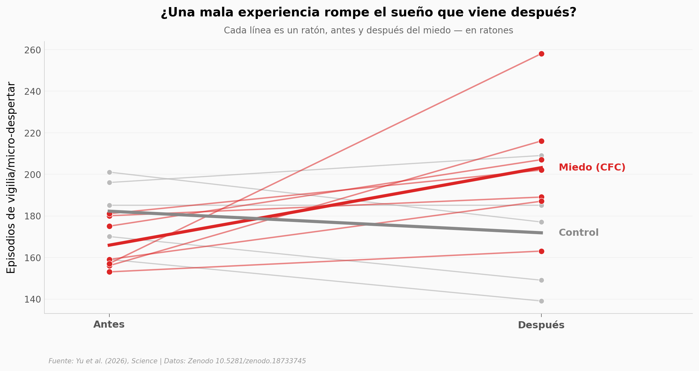

# ¿El miedo te rompe el sueño? Lo que se ve en ratones

Un equipo registró el sueño de ratones antes y después de una experiencia de miedo (condicionamiento de miedo contextual). Después del susto, el sueño se fragmentó: más micro-despertares, noche tras noche. Y no fue el promedio de unos pocos — le pasó a cada uno de los 7 animales.

**El hallazgo:** El miedo aumentó los episodios de vigilia/micro-despertar un **+22%** (de 165,9 a 203,1 por registro, *d* pareado = 1,13, Wilcoxon *p* = 0,016), con los **7/7 ratones** durmiendo más fragmentado. El sueño REM no cambió: el golpe es específico al eje vigilia–sueño profundo.

## Gráfica clave



## Reproducir

[](https://colab.research.google.com/github/Ciencia-a-Mordiscos/lab/blob/main/papers/2026-06-04-reactivacion-memoria-sueno/notebook.ipynb)

O localmente:
```bash
pip install pandas matplotlib numpy scipy
jupyter execute notebook.ipynb
```

## Datos

- `datos/fig1c_episodios_sueno.csv` — episodios de sueño (NREM / REM / Wake-MA) por animal, grupos Control y CFC, fases Pre/Post (72 filas; 7 ratones CFC, 5 Control).
- `datos/fig5b_sleep_stage_pct.csv` — porcentaje por etapa, Saline vs CNO (datos secundarios, no usados en la narrativa).
- `datos/fig5e_bout_duration_s.csv` — duración de episodios, Saline vs CNO (datos secundarios, no usados en la narrativa).

## Links

- **Video:** [Pendiente]
- **Paper:** [Science — DOI: 10.1126/science.aed8630](https://doi.org/10.1126/science.aed8630)
- **Datos originales:** [Zenodo 10.5281/zenodo.18733745](https://doi.org/10.5281/zenodo.18733745)
- **Código del paper:** [Bolei-engram/Memory-to-sleep-code](https://github.com/Bolei-engram/Memory-to-sleep-code)
