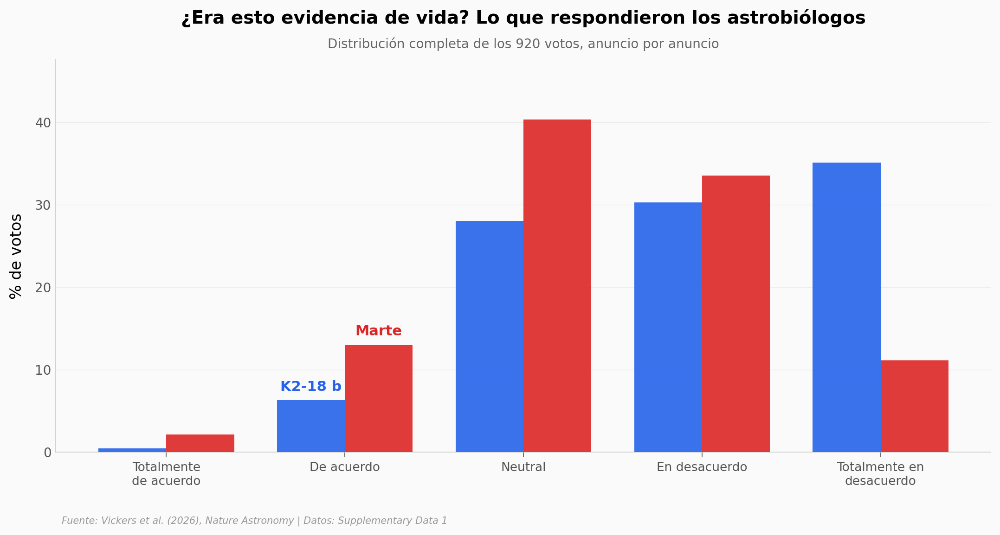

# ¿A los expertos los convence más Marte o un exoplaneta?

En 2025 hubo dos anuncios de posible vida fuera de la Tierra: gases raros en el exoplaneta **K2-18 b** (abril) y la roca marciana **Cheyava Falls** (septiembre). En vez de adivinar a quién le hizo más ruido a la comunidad, alguien encuestó directamente a 920 astrobiólogos.

**El hallazgo:** **Marte convenció más (41% de confianza media vs 28% para K2-18 b, +12 puntos porcentuales, Cohen's d = 0,57), pero aun en el caso más persuasivo, 3 de cada 4 expertos siguieron escépticos.** La encuesta mide *opinión*, no si hay vida.

## Gráfica clave



## Reproducir

[](https://colab.research.google.com/github/Ciencia-a-Mordiscos/lab/blob/main/papers/2026-06-05-astrobiologos-vida-extraterrestre/notebook.ipynb)

O localmente:
```bash
pip install pandas matplotlib numpy scipy
jupyter execute notebook.ipynb
```

## Datos

- `datos/votos_k2_18b.csv` — 496 votos sobre K2-18 b (vote, credence, response_label, discipline, timestamp)
- `datos/votos_mars.csv` — 424 votos sobre Cheyava Falls / Marte (mismas columnas)
- `datos/distribucion_respuestas.csv` — distribución agregada de las 5 categorías Likert para ambas encuestas

## Links

- **Video:** [Pendiente]
- **Paper:** [Nature Astronomy — DOI: 10.1038/s41550-026-02876-9](https://doi.org/10.1038/s41550-026-02876-9)
- **Datos originales:** [Supplementary Data 1 (mismo DOI)](https://static-content.springer.com/esm/art%3A10.1038%2Fs41550-026-02876-9/MediaObjects/41550_2026_2876_MOESM2_ESM.xlsx)
