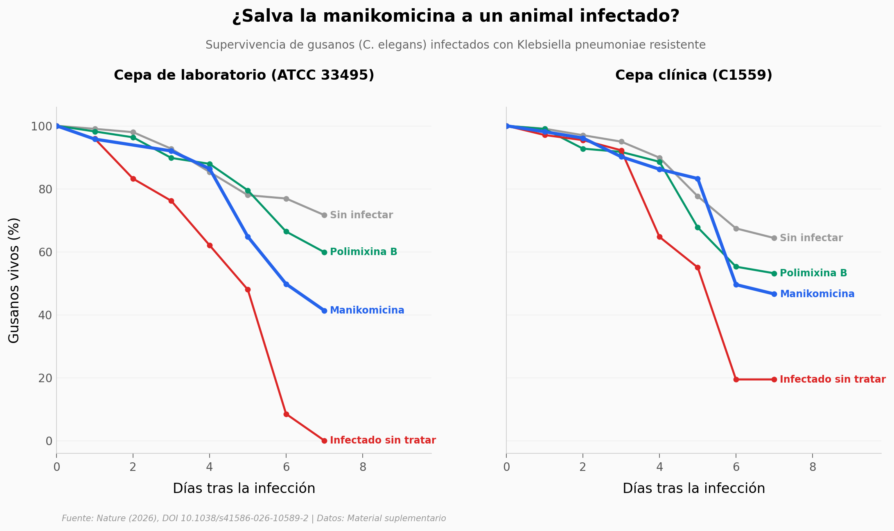

# Manikomicina: una bacteria "agotada" escondía un antibiótico nuevo

*Streptomyces rimosus* lleva 80 años dándonos la oxitetraciclina y se daba por exprimida. Con una técnica de separación más fina, el mismo microbio reveló una molécula nueva —la **manikomicina**— que mata bacterias resistentes a casi todo y lo hace de una forma que ningún antibiótico conocido había usado: pegándose al **sitio E** del ribosoma bacteriano.

**El hallazgo:** **La manikomicina rescató al 41 % de los gusanos infectados con una cepa que, sin tratamiento, no dejaba a ninguno con vida al día 7** —pero todavía rescata menos que la polimixina B y desaparece de la sangre en horas.

## Gráfica clave



## Reproducir

[](https://colab.research.google.com/github/Ciencia-a-Mordiscos/lab/blob/main/papers/2026-06-06-manikomycin-antibiotico-ribosoma/notebook.ipynb)

O localmente:
```bash
pip install pandas matplotlib numpy scipy
jupyter execute notebook.ipynb
```

## Datos

- `datos/farmacocinetica_mkm.csv` — concentración media de manikomicina en sangre por tiempo (7 tiempos, 3 ratones, dosis 50 mg/kg s.c.)
- `datos/farmacocinetica_mkm_raw.csv` — la misma farmacocinética, valor por ratón (21 filas)
- `datos/supervivencia_celegans.csv` — supervivencia Kaplan-Meier de *C. elegans* infectados con *K. pneumoniae* (2 cepas × 4 condiciones, hasta día 7)

## Links

- **Video:** [Pendiente]
- **Paper:** [Nature — DOI: 10.1038/s41586-026-10589-2](https://doi.org/10.1038/s41586-026-10589-2)
- **Datos originales:** [Material suplementario (Nature, mismo DOI)](https://doi.org/10.1038/s41586-026-10589-2)
- **Estructuras:** [PDB 9RJA / 9RFW](https://www.rcsb.org/structure/9RJA)
