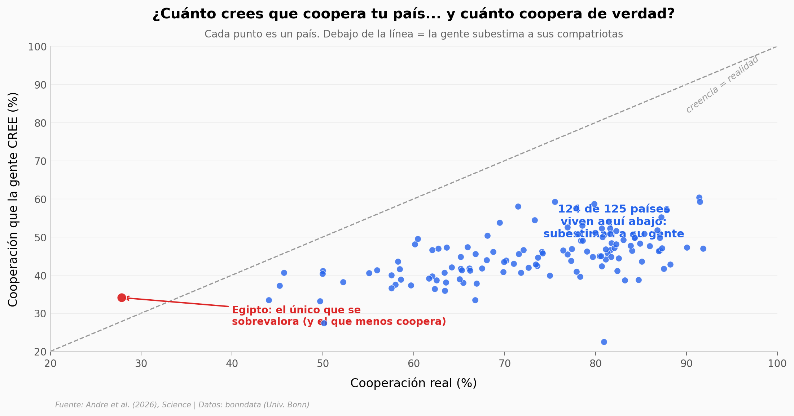

# Homo cooperans: somos más cooperativos de lo que creemos

Cuando 101.123 personas de 125 países se sentaron frente a un desconocido a decidir si cooperar o no, cerca de **dos tercios cooperó**. Pero casi nadie lo esperaba: la gente cree que sus compatriotas cooperan mucho menos de lo que realmente lo hacen.

**El hallazgo:** **124 de 125 países subestiman a su propia gente** — una brecha media de **28 puntos porcentuales** entre lo que la gente cree (~45%) y lo que de verdad pasa (~73%).

## Gráfica clave



## Reproducir

[](https://colab.research.google.com/github/Ciencia-a-Mordiscos/lab/blob/main/papers/2026-06-07-homo-cooperans-cooperacion-global/notebook.ipynb)

O localmente:
```bash
pip install pandas matplotlib numpy scipy
jupyter execute notebook.ipynb
```

## Datos

- `datos/cooperacion_por_pais.csv` — 125 países: tasa de cooperación, creencia, brecha de percepción, norma social y preferencias (z-scores).
- `datos/cooperacion_por_continente.csv` — agregados por continente (5).
- `datos/efecto_tratamiento.csv` — control vs tratamiento de información (N = 101.123).

## Links

- **Video:** [Pendiente]
- **Paper:** [Science — DOI: 10.1126/science.aec9483](https://doi.org/10.1126/science.aec9483)
- **Datos originales:** [Replication Package — bonndata, Universität Bonn](https://doi.org/10.60507/FK2/YIWR09)
