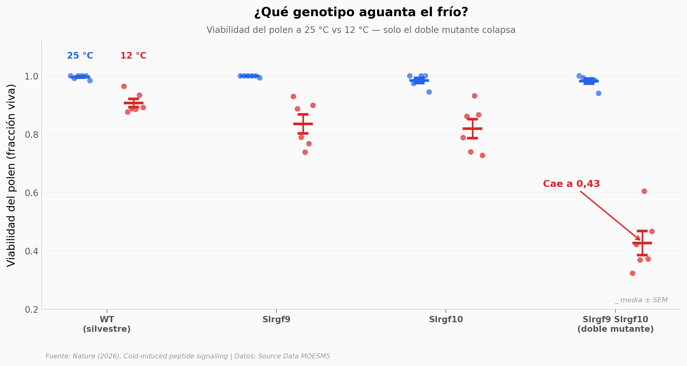

# Una helada en flor: los péptidos que salvan la cosecha

Una sola noche de frío durante la floración puede dejar estéril un cultivo entero: el polen aborta y los granos no se forman. Un equipo identificó en el tomate dos péptidos diminutos —SlRGF9 y SlRGF10— que se encienden con el frío y protegen el polen. Apágalos con CRISPR y el polen colapsa apenas baja la temperatura; súbelos y la planta defiende su cosecha. Y el mismo mecanismo funciona en arroz, una planta que se separó del tomate hace más de 150 millones de años.

**El hallazgo:** quitar **los dos péptidos a la vez** hunde la viabilidad del polen bajo frío de ~0,99 a **0,43** (caída del 56,6 %, Cohen's d = 6,4); quitar solo uno apenas afecta — los dos se respaldan mutuamente.

## Gráfica clave



## Reproducir

[](https://colab.research.google.com/github/Ciencia-a-Mordiscos/lab/blob/main/papers/2026-06-07-peptidos-frio-polen-cultivos/notebook.ipynb)

O localmente:
```bash
pip install pandas matplotlib numpy scipy
jupyter execute notebook.ipynb
```

## Datos

- `datos/pollen_viability_cold.csv` — Viabilidad de polen (tinción Alexander, fracción 0–1) en WT / Slrgf9 / Slrgf10 / doble mutante, a 25 °C y 12 °C. 48 mediciones (6 réplicas × 4 genotipos × 2 temperaturas). Fig. 1f.
- `datos/fig5e_tomato_yield.csv` — Producción reproductiva de tomate (unidad relativa) en WT vs líneas de sobreexpresión 35S:SlRGF9 y 35S:SlRGF10. 15 plantas (n = 5/grupo). Fig. 5e.
- `datos/fig5l_rice_yield.csv` — Granos por planta en arroz (ZH11 WT vs 3 líneas OsRGF10pro:OsRGF10). 16 plantas (n = 4/grupo). Fig. 5l.

## Links

- **Video:** [Ver en YouTube](https://youtube.com/shorts/DcE-aPw5fE8)
- **Paper:** [Nature — DOI: 10.1038/s41586-026-10603-7](https://doi.org/10.1038/s41586-026-10603-7)
- **Datos originales:** Source Data (MOESM5) del paper, alojados por Nature/Springer
