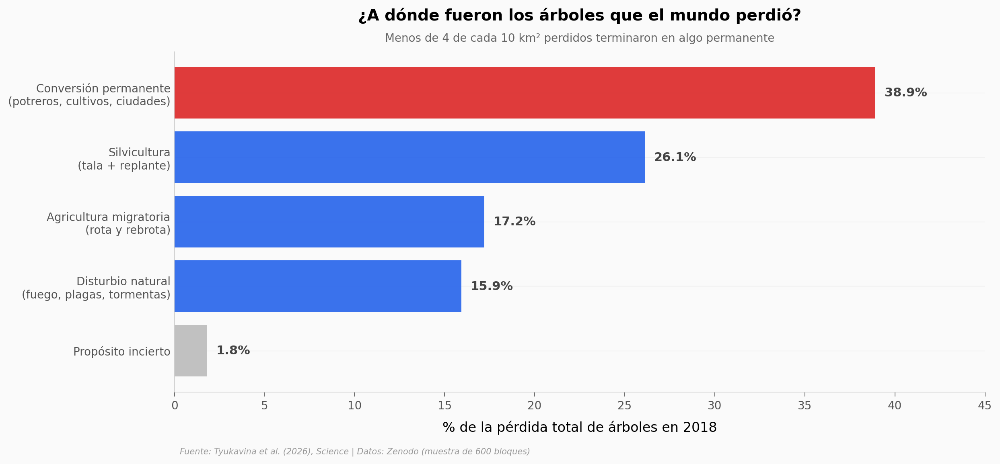

# El mundo perdió 277.000 km² de árboles en un solo año

En 2018 desapareció una superficie de cobertura arbórea mayor que todo el Reino Unido. Pero el titular "deforestación" esconde una historia más fina: cuando miras parche por parche con satélite de alta resolución, descubres que la mayor parte de esa pérdida no es permanente — rota, se replanta o se recupera.

**El hallazgo:** **solo el 38,9% de la pérdida fue conversión permanente** de tierra; y cuando un bosque *natural* sí desaparece para siempre, el **pasto para ganado es la causa #1 (15,0%)**, por encima de cultivos y plantaciones juntos.

## Gráfica clave



## Reproducir

[](https://colab.research.google.com/github/Ciencia-a-Mordiscos/lab/blob/main/papers/2026-06-07-perdida-cobertura-arborea-global/notebook.ipynb)

O localmente:
```bash
pip install pandas matplotlib numpy
jupyter execute notebook.ipynb
```

## Datos

- `datos/perdida_por_grupo.csv` — pérdida por macro-categoría (4 grupos + incierto), survey-weighted
- `datos/perdida_natural_por_driver.csv` — pérdida de cobertura natural por causa (20 drivers)
- `datos/perdida_por_region.csv` — pérdida por región geográfica (7 regiones)
- `datos/distribucion_perdida_bloque.csv` — % perdido en cada uno de los 600 bloques de 5×5 km

## Links

- **Video:** [Ver en YouTube](https://youtube.com/shorts/qPO0mdpG1iY)
- **Paper:** [Science — DOI: 10.1126/science.adz9042](https://doi.org/10.1126/science.adz9042)
- **Datos originales:** [Zenodo](https://doi.org/10.5281/zenodo.17652508) · [código archivado](https://doi.org/10.5281/zenodo.17652863)
