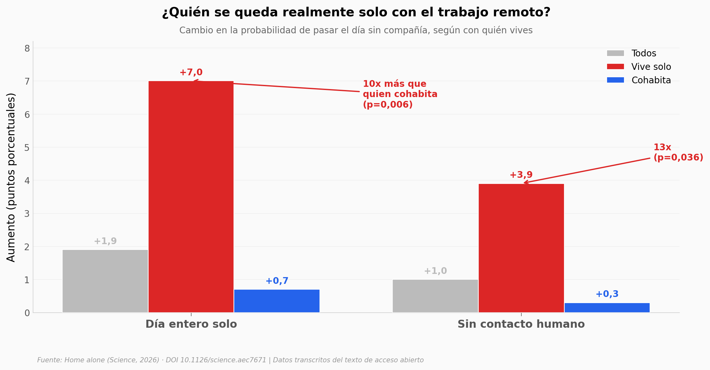

# ¿El trabajo remoto te deja solo?

Entre 2019 y 2023 el trabajo remoto en EE.UU. se cuadruplicó (del 7% al 28%). Cinco encuestas nacionales con 588.322 trabajadores rastrearon qué le hizo eso al aislamiento y la salud mental, comparando trabajos remotables contra no remotables (diferencias en diferencias).

**El hallazgo:** El efecto se concentra en **quien vive solo** — suma **7 puntos porcentuales** de días enteros sin compañía, **diez veces** lo de quien cohabita. Los autores estiman que el trabajo remoto explica **cerca de un tercio** del aumento nacional de soledad y distrés mental.

## Gráfica clave



## Reproducir

[](https://colab.research.google.com/github/Ciencia-a-Mordiscos/lab/blob/main/papers/2026-06-07-trabajo-remoto-soledad-mental/notebook.ipynb)

O localmente:
```bash
pip install pandas matplotlib numpy
jupyter execute notebook.ipynb
```

## Datos

- `datos/cambio_remoto.csv` — salto del trabajo remoto (DiD), remotables vs no remotables
- `datos/jornada_solo.csv` — jornadas 100% en solitario, casa vs oficina
- `datos/contacto_social.csv` — días en soledad y sin contacto, por situación de vivienda (incluye p del contraste entre grupos)
- `datos/salud_mental.csv` — señales de salud mental (K-6, días deprimido, uso de servicios, medicación)
- `datos/vive_solo_amplificacion.csv` — amplificación del efecto en quien vive solo
- `datos/atribucion_nacional.csv` — fracción del aumento nacional atribuible al remoto (~1/3)

## Links

- **Video:** [Pendiente]
- **Paper:** [Science — DOI: 10.1126/science.aec7671](https://doi.org/10.1126/science.aec7671)
- **Datos originales:** [Dryad](https://doi.org/10.5061/dryad.w3r22816p) (en curación al momento de extraer; valores transcritos del texto de acceso abierto)
