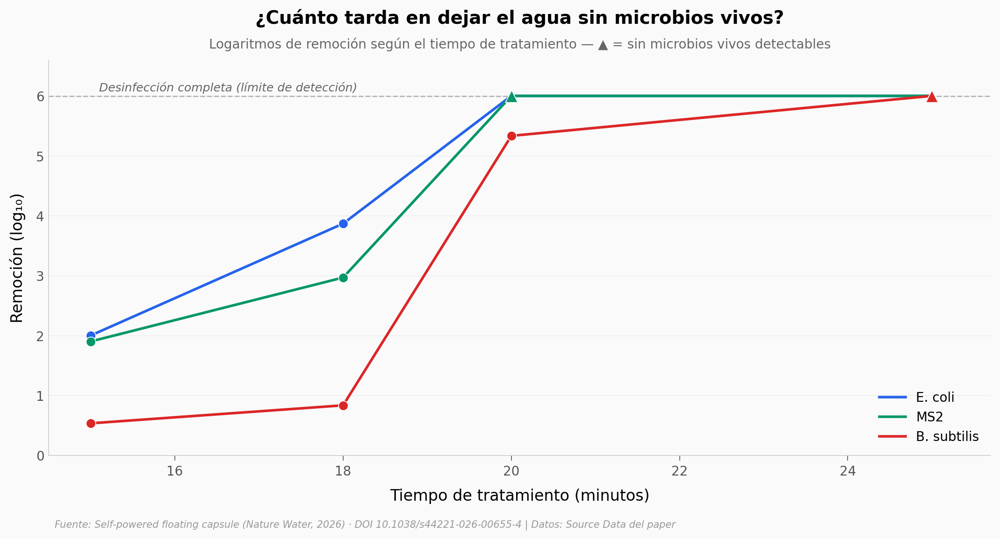

# Una cápsula que potabiliza agua solo agitándola

Un dispositivo flotante del tamaño de un pulgar que **detecta y desinfecta agua sin pilas ni químicos**: la energía sale de agitarlo a mano. Mide la calidad del agua (sólidos disueltos totales) y, si pasa el filtro, mata los microbios por electroporación —campos eléctricos intensos que rompen su membrana—.

**El hallazgo:** logra **desinfección completa (6 log de remoción = sin microbios vivos detectables)** en 20–25 minutos y la sostiene a lo largo de **120 ciclos sin degradarse**.

## Gráfica clave



## Reproducir

[](https://colab.research.google.com/github/Ciencia-a-Mordiscos/lab/blob/main/papers/2026-06-08-capsula-flotante-agua/notebook.ipynb)

O localmente:
```bash
pip install pandas matplotlib numpy scipy
jupyter execute notebook.ipynb
```

## Datos

- `datos/desinfeccion_tiempo.csv` — log de remoción por patógeno (E. coli, B. subtilis, MS2) a 15/18/20/25 min. 12 filas.
- `datos/sensor_vs_comercial.csv` — TDS del sensor autoalimentado vs medidor comercial HANNA en grifo, río y lago (3 réplicas c/u). 9 filas.
- `datos/potencia_vs_carga.csv` — densidad de corriente y potencia vs impedancia de carga (1k–10M Ω). 13 filas.
- `datos/durabilidad_ciclos.csv` — log de remoción sostenido por ciclo (0–120) para los 3 patógenos. 31 filas.

> Los valores "≥N log" son límites inferiores censurados al límite de detección: significan "sin microbios vivos detectables", no un conteo exacto.

## Links

- **Video:** [Ver en YouTube](https://youtube.com/shorts/vE4msi4HtP4)
- **Paper:** [Nature Water — DOI: 10.1038/s44221-026-00655-4](https://doi.org/10.1038/s44221-026-00655-4)
- **Datos originales:** [Source Data del paper (Nature Water)](https://doi.org/10.1038/s44221-026-00655-4)
