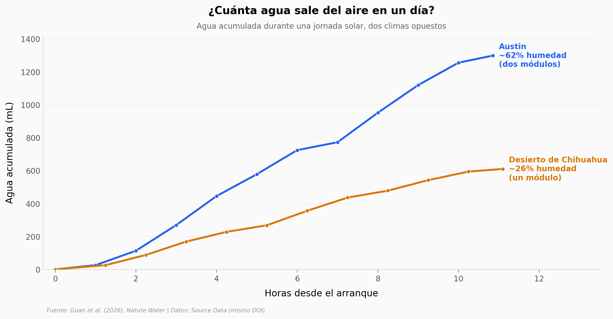

# Agua del aire, con sol: 1,3 litros en un día

Un equipo armó una maleta solar que saca agua potable del aire — y funciona tanto en el Austin húmedo como en pleno desierto de Chihuahua, donde hay menos de la mitad de humedad.

**El hallazgo:** la humedad cae de **62% a 26%** pero la tasa de cosecha por área baja solo **~9%** (de 4,7 a 4,3 L/m²/día). El aparato casi no se inmuta con el clima.

## Gráfica clave



## Reproducir

[](https://colab.research.google.com/github/Ciencia-a-Mordiscos/lab/blob/main/papers/2026-06-09-cosecha-agua-atmosferica-solar/notebook.ipynb)

O localmente:
```bash
pip install pandas matplotlib numpy scipy
jupyter execute notebook.ipynb
```

## Datos

- `datos/agua_acumulada.csv` — agua acumulada por hora en los dos trials (24 filas, Austin y Chihuahuan).
- `datos/temperatura_capas_austin.csv` — perfil térmico minuto a minuto del trial de Austin (657 filas, 4 capas).
- `datos/rendimiento_solar.csv` — rendimiento diario vs intensidad solar por día (11 días; 10 single + 1 dual).

## Links

- **Video:** [Pendiente]
- **Paper:** [Nature Water — DOI: 10.1038/s44221-026-00645-6](https://doi.org/10.1038/s44221-026-00645-6)
- **Datos originales:** [Source Data Figs. 1–4 (mismo DOI)](https://static-content.springer.com/esm/art%3A10.1038%2Fs44221-026-00645-6/MediaObjects/44221_2026_645_MOESM2_ESM.zip)
