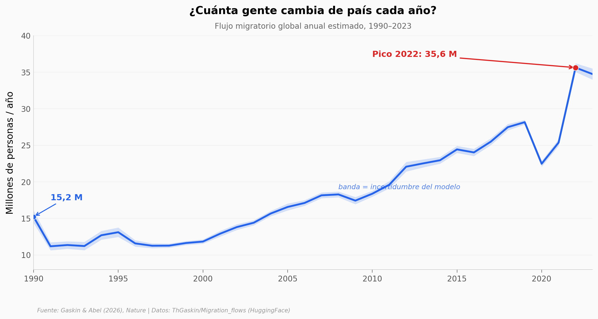

# Aprendizaje profundo de cuatro décadas de migración humana

Un equipo en Nature entrenó un conjunto de redes neuronales para reconstruir, año por año, cuánta gente migró entre 230 países y regiones desde 1990. Cada cifra viene con su banda de incertidumbre — porque son estimaciones de un modelo, no conteos directos.

**El hallazgo:** **El flujo migratorio global anual pasó de 15,2 a 34,7 millones de personas entre 1990 y 2023 (x2,28), con un máximo de 35,6 millones en 2022.** Y la incertidumbre, que es de apenas 2% a escala global, se multiplica por 7 cuando bajas a cada país.

## Gráfica clave



## Reproducir

[](https://colab.research.google.com/github/Ciencia-a-Mordiscos/lab/blob/main/papers/2026-06-10-deep-learning-migracion-humana/notebook.ipynb)

O localmente:
```bash
pip install pandas matplotlib numpy
jupyter execute notebook.ipynb
```

## Datos

- `datos/migracion_global_por_anio.csv` — agregado global por año (35 filas, 1990-2024), con desviación estándar propagada.
- `datos/migracion_por_pais_anio.csv` — flujos y stocks por país-año (8.085 filas, 231 países × 35 años): net, imm, emi y sus std.
- `datos/shocks_emigracion_serie.csv` — serie de emigración de Ucrania, Venezuela y Siria (1990-2023).

## Links

- **Video:** [Ver en YouTube](https://youtube.com/shorts/ya1KCDnbaq8)
- **Paper:** [Nature — DOI: 10.1038/s41586-026-10611-7](https://doi.org/10.1038/s41586-026-10611-7)
- **Datos originales:** [ThGaskin/Migration_flows (HuggingFace)](https://huggingface.co/datasets/ThGaskin/Migration_flows)
