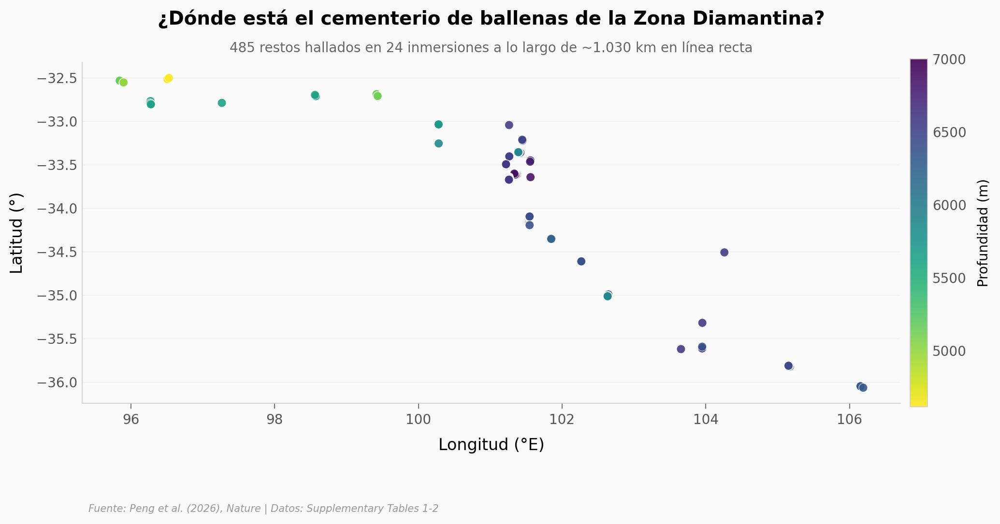

# Una necrópolis de ballenas de 5,3 millones de años en el fondo del Índico

Cuando una ballena muere, su cuerpo se hunde kilómetros hasta el fondo del mar y se convierte en un oasis de vida en mitad del desierto abisal. Durante décadas se conocían apenas un puñado de estas *caídas de ballena*. Un rastreo de la Zona Diamantina, en el océano Índico suroriental, encontró **486 restos de ballena** regados a lo largo de ~1.200 km de fondo marino, entre los 4.616 y los 7.001 metros de profundidad.

**El hallazgo:** **El 83% de este cementerio descansa a más de 6 km de profundidad, y la datación isotópica sitúa algunas caídas hace al menos 5,3 millones de años** — convirtiendo el fondo del mar en un archivo fósil de la evolución de las ballenas.

## Gráfica clave



## Reproducir

[](https://colab.research.google.com/github/Ciencia-a-Mordiscos/lab/blob/main/papers/2026-06-10-necropolis-ballenas-diamantina/notebook.ipynb)

O localmente:
```bash
pip install pandas matplotlib numpy
jupyter execute notebook.ipynb
```

## Datos

- `datos/whale_observations.csv` — 486 observaciones del sumergible (longitud, latitud, profundidad, huesos, etapa ecológica) en 24 inmersiones.
- `datos/comunidad_por_taxon.csv` — composición faunística: 20 taxones (5 filos), individuos por taxon en los 5 oasis modernos.

## Links

- **Video:** [Ver en YouTube](https://youtube.com/shorts/nCmyGzQPqgY)
- **Paper:** [Nature — DOI: 10.1038/s41586-026-10546-z](https://doi.org/10.1038/s41586-026-10546-z)
- **Datos originales:** Supplementary Tables 1-2 (MOESM3) · [Science Data Bank](https://doi.org/10.57760/sciencedb.28830)
