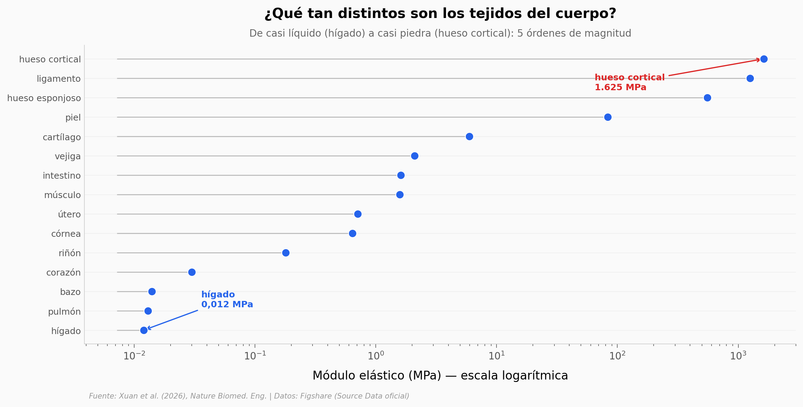

# Tu hígado es gelatina. Tu hueso es piedra.

Entre el tejido más blando del cuerpo (el hígado, casi líquido) y el más rígido (el hueso cortical, casi piedra) hay **135.417 veces** de diferencia en rigidez — cinco órdenes de magnitud. Un solo pegamento médico no puede servir para los dos. Un equipo usó machine learning para diseñar un pegamento distinto a la medida de cada tejido: los **TuneGlues**.

**El hallazgo:** **cada TuneGlue cae en el régimen mecánico de su tejido** (5 de 6 dentro de ~2x, a lo largo de 5 órdenes de magnitud), y el modelo predice el módulo elástico con **R²=0,97**. En un modelo animal de hígado, el TuneGlue bajó el tiempo de hemostasia de **363 s a 30 s** (n=3).

## Gráfica clave



## Reproducir

[](https://colab.research.google.com/github/Ciencia-a-Mordiscos/lab/blob/main/papers/2026-06-11-bioglues-ml-multitejido-trauma/notebook.ipynb)

O localmente:
```bash
pip install pandas matplotlib numpy scipy
jupyter execute notebook.ipynb
```

## Datos

- `datos/tejidos_propiedades_mecanicas.csv` — módulo elástico / resistencia / deformación de 15 tejidos humanos (Fig 2h)
- `datos/ml_validacion_r2.csv` — R² de validación cruzada 5-fold de los modelos ML (RFR/NN) para 3 propiedades (Fig 2j)
- `datos/tuneglue_vs_tejido.csv` — TuneGlue vs tejido nativo, 6 tejidos × 3 propiedades × 3 réplicas (Fig 4d)
- `datos/adhesion_por_tejido.csv` — adhesión (kPa) de cada TuneGlue por tejido, 3 réplicas (Fig 4f)
- `datos/hemostasia_tiempo.csv` — tiempo de hemostasia control vs TuneGlue-liver, n=3 c/u (Fig 5f)

## Limitaciones

- Todos los resultados in vivo (adhesión, hemostasia, cicatrización) son en **modelos animales**, no en humanos ni en clínica.
- La hemostasia tiene **n=3 por grupo**: muestra dirección y magnitud, no significancia estadística (p=0,10 es el mínimo posible con ese n).
- El "match" tejido-pegamento es de orden de magnitud / régimen mecánico, **no exacto**.

## Links

- **Video:** [Ver en YouTube](https://youtube.com/shorts/sdXqL_-ytzs)
- **Paper:** [Nature Biomedical Engineering — DOI: 10.1038/s41551-026-01705-8](https://doi.org/10.1038/s41551-026-01705-8)
- **Datos originales:** [Figshare — Source Data oficial](https://doi.org/10.6084/m9.figshare.31769131)
