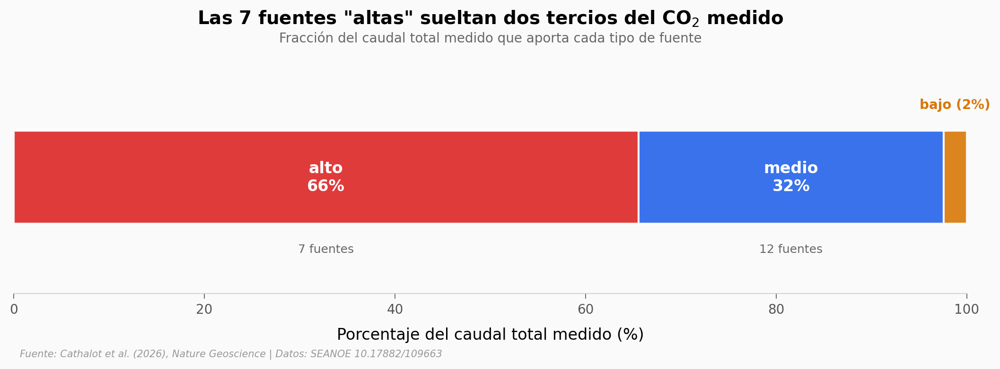

# CO₂ brotando del fondo del mar: el campo de seeps de Mayotte

A más de 1.300 metros bajo el agua, frente a la isla de Mayotte, el fondo del mar suelta dióxido de carbono. Una expedición con ROV midió el caudal de 22 fuentes y, a partir de ahí, extrapoló cuánto CO₂ escapa del campo completo.

**El hallazgo:** las 7 fuentes "altas" sueltan **dos tercios (65,5%) del caudal medido**, y el flujo total del campo se estima en **~154 mil toneladas de carbono al año** — aunque la cifra depende del modelo espacial (148–198 mil tC/año).

## Gráfica clave



## Reproducir

[](https://colab.research.google.com/github/Ciencia-a-Mordiscos/lab/blob/main/papers/2026-06-12-co2-seeps-hidratos-mayotte/notebook.ipynb)

O localmente:
```bash
pip install pandas matplotlib numpy scipy
jupyter execute notebook.ipynb
```

## Datos

- `datos/mediciones_seeps.csv` — caudal (ml/s) de 22 fuentes individuales medidas por ROV, con sitio, tipo (alto/medio/bajo), profundidad (1.220–1.509 m) y coordenadas.
- `datos/flux_extrapolado.csv` — 6.000 estimaciones Monte Carlo del flujo total de CO₂ del área Horseshoe, bajo 3 modelos de distribución espacial × 2 de densidad.

## Links

- **Video:** [Pendiente]
- **Paper:** [Nature Geoscience — DOI: 10.1038/s41561-026-02004-2](https://doi.org/10.1038/s41561-026-02004-2)
- **Datos originales:** [SEANOE — DOI: 10.17882/109663](https://doi.org/10.17882/109663)
