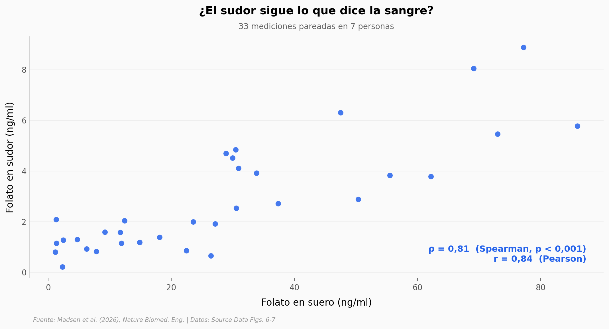

# Un sticker en la piel que lee tu nutrición en el sudor

Medir folato hoy pide un pinchazo y un laboratorio. Un equipo construyó una microcápsula que se pega a la piel, recoge microlitros de sudor limpio y los pasa a un *lab-on-a-disc* portátil que corre el ensayo completo. La pregunta de fondo: ¿el folato del sudor refleja el de la sangre? Estos datos dicen que sí — con un matiz importante de alcance.

**El hallazgo:** el folato en sudor sigue al de suero con **Spearman ρ = 0,84** (33 pares de 7 personas), y el disco portátil concuerda con el ELISA de laboratorio con **r = 0,97**. Validado en **7 adultos sanos, ninguna embarazada** — lo "prenatal" es la meta a futuro, no algo probado aquí.

## Gráfica clave



## Reproducir

[](https://colab.research.google.com/github/Ciencia-a-Mordiscos/lab/blob/main/papers/2026-06-17-folato-sudor-prenatal/notebook.ipynb)

O localmente:
```bash
pip install pandas matplotlib numpy scipy
jupyter execute notebook.ipynb
```

## Datos

- `datos/correlacion_sudor_suero.csv` — 33 pares folato sudor/suero, 7 personas (Source Data Fig. 7f)
- `datos/cinetica_temporal.csv` — folato sudor y suero hora a hora tras la ingesta, 5 personas (Fig. 7a-e)
- `datos/seguimiento_diario.csv` — seguimiento diario control vs ingesta, 2 personas (Fig. 7j-k)
- `datos/validacion_dispositivo.csv` — disco lab-on-a-disc vs ELISA de placa, 14 muestras (Fig. 6f)
- `datos/calibracion_sensor.csv` — curva de calibración del sensor, rango 0,5–200 ng/ml (Fig. 6e)

## Links

- **Video:** [Ver en YouTube](https://youtube.com/shorts/vyxgtAuFCvA)
- **Paper:** [Nature Biomedical Engineering — DOI: 10.1038/s41551-026-01716-5](https://doi.org/10.1038/s41551-026-01716-5)
- **Datos originales:** [Source Data del paper (mismo DOI)](https://doi.org/10.1038/s41551-026-01716-5)
