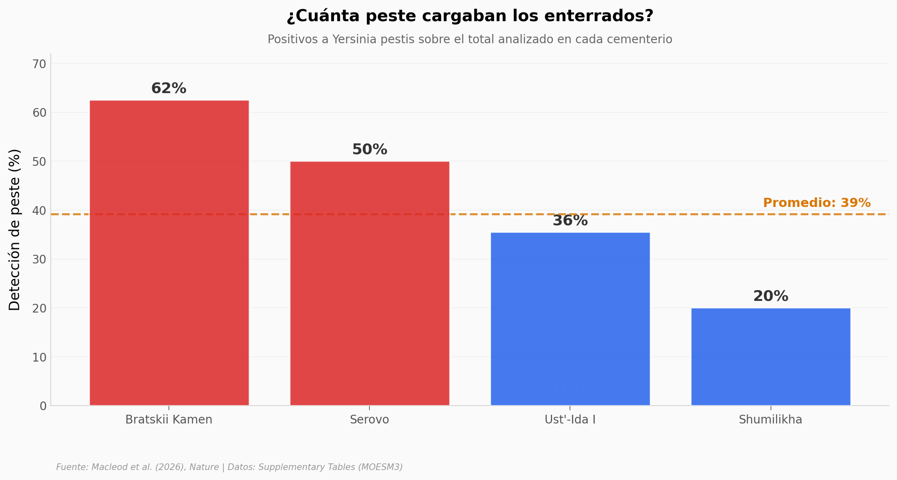

# La peste no nació en las ciudades

Durante décadas se pensó que la peste necesitaba aglomeración para volverse letal: ciudades, graneros, gente apretada del Neolítico. Pero el ADN antiguo de cuatro cementerios de cazadores-recolectores junto al lago Baikal, en Siberia, cuenta otra historia. Hace unos 5.500 años, estos grupos móviles ya morían de peste.

**El hallazgo:** **39% de los individuos analizados** (18 de 46) dieron positivo a *Yersinia pestis*, y la mediana de edad al morir fue de apenas **14,5 años**.

## Gráfica clave



## Reproducir

[](https://colab.research.google.com/github/Ciencia-a-Mordiscos/lab/blob/main/papers/2026-06-17-peste-baikal-cazadores/notebook.ipynb)

O localmente:
```bash
pip install pandas matplotlib numpy
jupyter execute notebook.ipynb
```

## Datos

- `datos/deteccion_por_cementerio.csv` — positivos / cohorte por cementerio (4 sitios, derivado de MOESM3).
- `datos/victimas_plaga.csv` — 18 víctimas con peste: cementerio, sexo, edad estimada y fecha calibrada (cal BP).
- `datos/plague_raxml.bestTree` — árbol filogenético RAxML de las cepas (no usado en el notebook; incluido como dato bruto).

## Links

- **Video:** _Pendiente_
- **Paper:** [Nature — DOI: 10.1038/s41586-026-10540-5](https://doi.org/10.1038/s41586-026-10540-5)
- **Datos originales:** [Supplementary Tables (MOESM3)](https://static-content.springer.com/esm/art%3A10.1038%2Fs41586-026-10540-5/MediaObjects/41586_2026_10540_MOESM3_ESM.xlsx) · [GitHub ramacleod/Prehistoric_plague_MAT](https://github.com/ramacleod/Prehistoric_plague_MAT)
